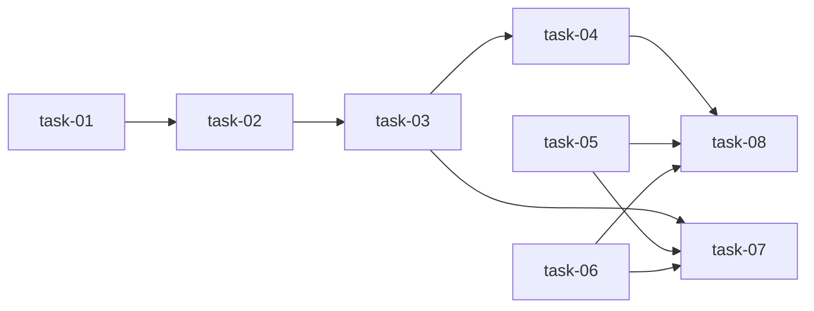

# 实现计划

author: qinyi
created_at: 2026-07-09 19:58:00

plan_level: full
reason: 8 个 task，CLI+平台+validator 联动（machine-interface 聚合 stage-contract/task-review/verify-postcheck，sync.js 平台 API）

## 来源

- design.md（§3 命令设计、§4 平台缺口、§5 文件变更清单、§9 验收标准）
- requirements.md（FR-01 ~ FR-06、NFR-01 ~ NFR-04）
- decisions.md（D-001@v1 ~ D-009@v1，全部 accepted，无未决项）

## 调用点搜索记录

```text
rg "saveWorkflowRun" src/
  src/index.js:1005   saveWorkflowRun(result, { cwd: dir, source: 'cli' })      ← CLI 直调，不透传（非平台模式，不改）
  src/run.js:3390     saveWorkflowRun(result, {...})   ← scan 深度扫描 postcheck（task-06 改）
  src/run.js:3431     saveWorkflowRun(result, {...})   ← archive 模块影响 postcheck（task-06 改）

rg "approve|reject" src/index.js
  src/index.js:854    await syncModule.approve(approveName, dir)                ← 路由已存在，签名不变
  src/index.js:865    await syncModule.reject(rejectName, reason, dir)          ← 路由已存在，签名不变

gate / derive 为全新子命令，无既有调用点。
```

## Wave 1（并行，无依赖）

- [ ] task-01: 新建 src/machine-interface.js — envelope/退出码/输出纪律 + gate 命令
- [ ] task-05: src/sync.js 实现 platform approve/reject（HTTP + approvals 表）
- [ ] task-06: src/run.js 两处 saveWorkflowRun 透传 runtimeRoot/scanRunId

## Wave 2（依赖 Wave 1）

- [ ] task-02: machine-interface.js — derive 四个 facet 实现

## Wave 3（依赖 Wave 2）

- [ ] task-03: src/index.js 路由 gate/derive 子命令 + usage 文本

## Wave 4（依赖 Wave 3）

- [ ] task-04: 新建 docs/sillyspec/interface-contract.md — v1 契约冻结
- [ ] task-07: 新增 test/machine-interface.test.mjs — 覆盖 9 条全局验收标准

## Wave 5（依赖 Wave 4）

- [ ] task-08: 同步 file-lifecycle 三份文档

## 任务总表

| 编号 | 任务 | Wave | 优先级 | 依赖 | 覆盖决策/需求 |
|---|---|---|---|---|---|
| task-01 | machine-interface.js 骨架 + gate | W1 | P0 | — | D-001@v1、D-002@v1、D-003@v1、D-004@v1、D-005@v1、D-008@v1，FR-01、FR-03 |
| task-02 | derive 四个 facet | W2 | P0 | task-01 | D-003@v1，FR-02 |
| task-03 | index.js 路由接线 | W3 | P0 | task-02 | D-001@v1，FR-01、FR-02 |
| task-04 | interface-contract.md 契约冻结 | W4 | P0 | task-03 | D-005@v1、D-009@v1，FR-04 |
| task-05 | platform approve/reject 实现 | W1 | P1 | — | D-006@v1，FR-05 |
| task-06 | saveWorkflowRun runtimeRoot 透传 | W1 | P1 | — | D-006@v1，FR-06 |
| task-07 | machine-interface 测试套件 | W4 | P0 | task-03, task-05, task-06 | NFR-04，验收 1-6 |
| task-08 | file-lifecycle 文档同步 | W5 | P2 | task-04, task-05, task-06 | 仓库文档同步铁律 |

> D-007@v1（无生命周期契约）为约束性决策，由全局验收第 8 条兜底核验，不对应单独 task。

## 依赖关系图



## 关键路径

task-01 → task-02 → task-03 → task-04 → task-08（machine-interface 主线；task-05/06 可在 Wave 1 并行消化）

## 全局验收标准

1. `sillyspec gate execute --change <c> --json`：产物齐全且有真实代码变更时 exit 0；伪造 review.json 或零代码变更时 exit 1 且 errors 指明原因；变更不存在时 exit 2。
2. `sillyspec derive <facet> --change <c> --json` 四个 facet 各返回对应事实结构；非法 facet exit 2。
3. 只读性：任一 gate/derive 调用前后 sillyspec.db 内容 hash 不变，gate-status.json 不产生/不变化。
4. `--json` 模式 stdout 可被 `JSON.parse` 直接解析（含内部异常兜底场景）。
5. `platform approve/reject` 对 mock HTTP 端点完成调用并更新 approvals 表；网络失败 exit 1 且有可读错误。
6. 平台模式（带 runtimeRoot/scanRunId）scan postcheck 的 workflow run 落 `<runtimeRoot>/scan-runs/<scanRunId>/workflow-runs/`。
7. gate 输出中 artifacts 与 execute-evidence 结论不矛盾（D-008@v1 一致性断言）。
8. 兼容性（brownfield）：不改 `run`/`progress` 存量行为与输出格式；非平台模式 saveWorkflowRun 落盘路径与现状一致；本变更不新增任何生命周期状态机（D-007@v1）；全量 `npm test` 通过。
9. `docs/sillyspec/interface-contract.md` 与实现一致，含慢命令/重复执行（D-009@v1）与 TBD-hub-api 章节。

## 自检

- [x] 每个 task 有编号且在 Wave 下有 checkbox
- [x] 任务总表含优先级、依赖列，无估时列
- [x] 关键路径已标注
- [x] D-001~D-009 全部可追踪（任务总表覆盖列 + D-007 全局验收兜底）
- [x] 无 P0/P1 unresolved blocker
- [x] plan.md 无实现细节（细节在 tasks/task-NN.md）
- [x] 与 design.md §5 文件变更清单一致（9 个文件全部被 task allowed_paths 覆盖）
- [x] 调用点搜索输出已记录（见上）
- [x] 跨任务契约：task-03/04/07 的 expects_from 与 task-01/02 的 provides 字段一致（plan-postcheck 硬校验）
- [x] Mermaid 依赖图非平凡（钻石结构，非线性/非全并行）
