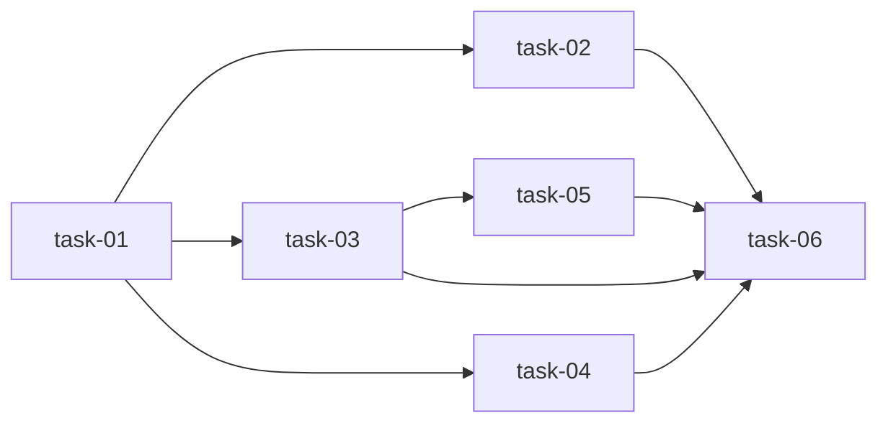

# 实现计划 — quick 会话状态隔离

## 来源
- design.md（§4 sessionId 分行；§4.5 hook 合并 guard）
- requirements.md（FR-01~05, NFR-01~04）
- decisions.md（D-001 分行 / D-002 hook 合并 / D-003 UUID8hex）

## Wave 1（基础，无依赖）
- [x] task-01: run.js — sessionId 生成（crypto.randomUUID 前 8 hex）+ changeName 解耦（去掉 run.js:1386 `quick → default` 硬编码，未传 --change 则用 quick-<uuid8>）+ 写 current-quick-run-id + prompt 输出 sessionId

## Wave 2（依赖 Wave 1，并行）
- [x] task-02: run.js — `--done` 恢复 sessionId（优先 `--change quick-<uuid8>`，fallback 读 current-quick-run-id）+ 收尾删 `.runtime/quick-sessions/<sid>/`
- [x] task-03: run.js + stages/quick.js — quick-guard.json 改写 `.runtime/quick-sessions/<sid>/guard.json`（含 sessionId 字段；旧单文件 unlink 改删 session 目录）
- [x] task-04: stages/quick.js — step1/3 prompt 适配（告知 agent 本会话 sessionId + --done 需带 --change）

## Wave 3（依赖 task-03）
- [x] task-05: hooks/worktree-guard.js — 读 guard 改合并所有活跃 `quick-sessions/*/guard.json`（baseline/allowedFiles 并集，D-002；不再依赖单 session 识别）

## Wave 4（依赖全部）
- [x] task-06: test/quick-session-isolation.test.mjs — 多会话隔离回归

## 任务总表

| 编号 | 任务 | Wave | 优先级 | 依赖 | 覆盖决策/需求 | allowed_paths |
|---|---|---|---|---|---|---|
| task-01 | run.js sessionId + changeName 解耦 | W1 | P0 | — | D-001, D-003, FR-01 | src/run.js |
| task-02 | --done 恢复 sessionId + 收尾 | W2 | P0 | task-01 | FR-03 | src/run.js |
| task-03 | guard 按 session 存 | W2 | P0 | task-01 | FR-04 | src/run.js, src/stages/quick.js |
| task-04 | prompt 适配 | W2 | P1 | task-01 | FR-03 | src/stages/quick.js |
| task-05 | hook 合并 guard | W3 | P0 | task-03 | D-002, FR-05 | src/hooks/worktree-guard.js |
| task-06 | 隔离测试 | W4 | P0 | task-01~05 | NFR-03, 验收 1-4 | test/quick-session-isolation.test.mjs |

## 依赖关系图

## 关键路径
task-01 → task-03 → task-05 → task-06（changeName 解耦 → guard 按 session → hook 合并 → 测试）

## 全局验收标准
1. 两 quick 会话 DB 状态独立（`progress.quick-<uuidA>` vs `progress.quick-<uuidB>`），不互相覆盖 steps。
2. `--done` 各推各的（A/B 各自收敛 3/3）。
3. quick-guard.json 按 session 隔离。
4. worktree-guard hook 合并所有活跃 session guard（两 session baseline/allowedFiles 不同时放行各自 allowedFiles）。
5. 向后兼容（旧 default 行 + 旧单文件 guard 不破坏）。
6. 全量 npm test 通过。

## 自检
- [x] 每 task 有编号 + Wave checkbox
- [x] 任务总表含优先级/依赖/allowed_paths/覆盖列
- [x] 关键路径标注（task-01→03→05→06）
- [x] Mermaid 依赖图非平凡
- [x] 与 design §5 文件清单一致
- [x] D-001~003 + FR-01~05 可追踪
- [x] 调用点全覆盖（run.js:1386/1597/1911/2924 + worktree-guard.js:598/683）
