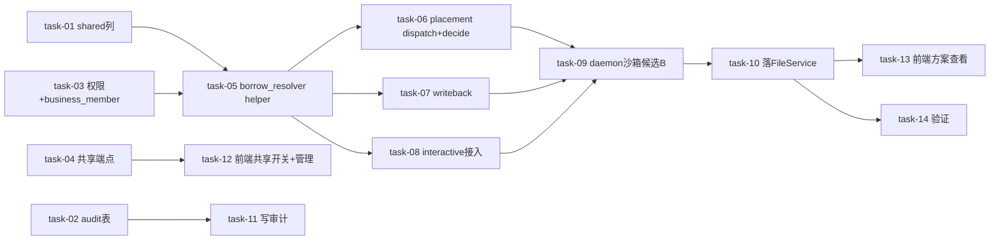

# 实现计划（Plan）— daemon-borrow-for-business

## Spike 前置验证

| Spike | 验证内容 | 不通过后果 |
|---|---|---|
| spike-01 | `_get_online_runtime`（placement.py:408，user 级查询不看 workspace binding）的借用接入方式：改造该函数 vs 调用方前置解析借用 daemon。权衡侵入度与 4 路一致性 | task-08 改接入方式，但不阻断主线（前置解析是兜底） |
| spike-02 | `text/markdown` 是否在 `settings.file_allowed_type_set` 白名单（file/service.py:59-64） | 不在则 task-10 加配置或 fallback `text/plain` |
| spike-03（可选） | 候选 A（daemon 侧注册独立 runtime_id）可行性 | 不阻塞——候选 B（D-007@v2 按 lease 隔离只读 policy）为主路径兜底 |

## Wave 1（并行，无依赖：数据模型 + 权限 + 共享端点）
- [x] task-01: `workspace_member_runtimes` 加 `shared` 列（bool 默认 false）+ 部分索引 + 迁移（覆盖：FR-01, D-005@v1）
- [x] task-02: `daemon_borrow_audit` 新表（borrower/lender/daemon/workspace/agent_run/borrowed_at/usage）+ 迁移（覆盖：FR-07, D-004@v1）
- [x] task-03: `DAEMON_BORROW` 权限点（permissions.py + group 分支）+ `business_member` 角色 + 权限种子迁移（task:run_agent + daemon:borrow + workspace 读）+ `members_service.py:42` `ROLE_KEY_WHITELIST` 加 business_member + grant 后 invalidate_all_permissions 对齐 rbac-permission-cache（覆盖：FR-03, D-006@v2）
- [x] task-04: lender `PUT /my-binding/shared` 标记/撤销端点 + owner `GET /shared-daemons` 查询/撤销端点（覆盖：FR-01, FR-02, D-003@v1）

## Wave 2（依赖 Wave 1：借用查询 + 共享 helper）
- [x] task-05: 新建 `agent/borrow_resolver.py`：`resolve_shared_daemon_for_borrow`（WHERE workspace + shared=TRUE + daemon 非空 + user_id≠actor + online + provider 解析，三重校验 DAEMON_BORROW/shared/online）+ `_resolve_borrowed_or_own_runtime` helper（先自有 binding 零回归，无则回退借用）（覆盖：FR-04, D-002@v1, D-008@v1）

## Wave 3（依赖 Wave 2：4 路 resolver 同语义接入，同 Wave 互验一致性）
- [x] task-06: `placement._resolve_dispatch_runtime`(690-807) + `_resolve_decide_runtime`(855-944) 接入 helper（覆盖：FR-04, D-008@v1）
- [x] task-07: `workspace/member_runtimes/resolver.resolve_runtime_for_writeback`(59-150) 接入 helper（覆盖：FR-04, D-008@v1）
- [x] task-08: `placement.prepare_interactive_dispatch._get_online_runtime`(408) 借用接入（含 spike-01 结论）（覆盖：FR-04, R-07）

## Wave 4（依赖 Wave 3：daemon 沙箱只读隔离）
- [x] task-09: borrow lease 独立 sandbox 目录（mirror by slug=`borrow-<actor>-<run>`，塞 lease rootPath，daemon.ts:2723）+ PolicyEngine 按 lease 而非 runtime 隔离只读 root_path（候选 B 主路径，session-manager.ts:1037-1102，不命中 lender allowed_roots）（覆盖：FR-05, D-007@v2, R-02）

## Wave 5（依赖 Wave 3/4：落点 + 审计）
- [x] task-10: 借用 agent run 完成回调（close_interactive_run/complete_lease）落 `FileService.upload_file`（owner_type=workspace, uploaded_by=borrower）+ 确认 markdown 白名单（spike-02）（覆盖：FR-06, D-001@v1, D-009@v1, D-010@v1）
- [x] task-11: 借用 lease 创建/完成时写 `daemon_borrow_audit` 记录（覆盖：FR-07, D-004@v1）

## Wave 6（依赖后端 API：前端）
- [x] task-12: lender 工作空间设置"共享我的 daemon"开关 + owner 成员/设置页（共享列表/撤销/授 business_member 角色）（覆盖：FR-01, FR-02）
- [x] task-13: 业务人员触发 agent（无感，复用现有）+ 文件中心/工作台看方案（覆盖：FR-04, FR-06）

## Wave 7（依赖全部：验证）
- [x] task-14: 单测（4 路 resolver 一致性 / 借用查询三重校验 / 写边界 borrow agent 不能写 lender 代码区 / 审计）+ 跨变更对齐核查（rbac-permission-cache 缓存失效 / llm-provider-management provider 额度 / platform-file-center file 落点）（覆盖：FR-05, FR-07, 全局验收）

## 任务总表

| 编号 | 任务 | Wave | 优先级 | 依赖 | 覆盖 FR/D | 说明 |
|---|---|---|---|---|---|---|
| task-01 | shared 列 + 迁移 | W1 | P0 | — | FR-01, D-005@v1 | model.py + alembic |
| task-02 | daemon_borrow_audit 表 + 迁移 | W1 | P0 | — | FR-07, D-004@v1 | 新表 |
| task-03 | DAEMON_BORROW + business_member 角色 + 种子 + 白名单 + 缓存失效 | W1 | P0 | — | FR-03, D-006@v2 | permissions + 新迁移 + members_service |
| task-04 | lender/owner 共享端点 | W1 | P0 | task-01 | FR-01, FR-02, D-003@v1 | my-binding/shared + shared-daemons |
| task-05 | borrow_resolver helper + 借用查询 | W2 | P0 | task-01, task-03 | FR-04, D-002@v1, D-008@v1 | 新建 borrow_resolver.py |
| task-06 | placement dispatch+decide 接入 | W3 | P0 | task-05 | FR-04, D-008@v1 | 2 路 |
| task-07 | writeback 接入 | W3 | P0 | task-05 | FR-04, D-008@v1 | 1 路 |
| task-08 | interactive _get_online_runtime 接入 | W3 | P0 | task-05, spike-01 | FR-04, R-07 | 1 路（user 级查询） |
| task-09 | daemon 沙箱 sandbox slug + lease 隔离只读 policy | W4 | P0 | task-06,07,08 | FR-05, D-007@v2, R-02 | 候选 B 主路径 |
| task-10 | 落 FileService + 白名单 | W5 | P0 | task-09, spike-02 | FR-06, D-001@v1, D-009@v1, D-010@v1 | close_interactive_run/complete_lease 回调 |
| task-11 | 写审计记录 | W5 | P1 | task-02 | FR-07, D-004@v1 | lease 创建/完成钩子 |
| task-12 | 前端 共享开关 + owner 管理 | W6 | P1 | task-04 | FR-01, FR-02 | 工作空间设置/成员页 |
| task-13 | 前端 业务触发 + 方案查看 | W6 | P1 | task-10 | FR-04, FR-06 | 复用触发 + 文件中心 |
| task-14 | 单测 + 跨变更核查 | W7 | P0 | 全部 | FR-05, FR-07, 全局验收 | 4 路一致性 + 写边界 |

## 关键路径

task-01 → task-05 → task-06/07/08（4 路一致）→ task-09（沙箱）→ task-10（落点）→ task-14（验证）

最长路径决定交付周期；task-02/03/04 可与 task-01 并行（W1），task-11/12/13 在主路径之外并行收尾。

## 依赖关系图

## 全局验收标准

- [ ] 所有单元测试通过（4 路 resolver 一致性 / 借用查询三重校验 / 写边界 / 审计）
- [ ] （brownfield）未配置新功能时行为不变：`shared` 默认 false、`DAEMON_BORROW` 默认不授、helper 第 1 步原路径返回——零回归
- [ ] 借用 agent **不能写开发人员代码区**（只读 root_path，写边界测试通过）
- [ ] 业务人员（business_member）触发 agent 自动借用工作空间在线共享 daemon，跑 agent 出方案
- [ ] 方案落文件中心，业务人员工作台可见（created_by=业务人员）
- [ ] 借用全程记审计（borrower/lender/daemon/workspace/run/usage）
- [ ] 跨变更无冲突：rbac-permission-cache 缓存失效对齐 / llm-provider-management provider 额度 / platform-file-center file 落点
- [ ] 改 router 跑对应 test_router；backend 用 `backend/.venv/Scripts/python.exe` 跑 pytest；daemon tsc + vitest；frontend pnpm lint/typecheck/test

## 覆盖矩阵

| ID | 覆盖任务 | 验收证据 |
|---|---|---|
| D-001@v1 | task-10 | 方案落文件中心，owner_type=workspace |
| D-002@v1 | task-05,06,07,08 | 自动借用回退 |
| D-003@v1 | task-04 | lender 共享 + owner 撤销端点 |
| D-004@v1 | task-02, task-11 | 审计表 + 写记录 |
| D-005@v1 | task-01 | shared 列加到 member_runtimes |
| D-006@v2 | task-03 | business_member 带 task:run_agent + daemon:borrow |
| D-007@v2 | task-09 | 候选 B 按 lease 隔离只读 policy |
| D-008@v1 | task-05,06,07,08 | 4 路 resolver 收敛 helper |
| D-009@v1 | task-10 | FileService.upload_file |
| D-010@v1 | task-10 | close_interactive_run/complete_lease 回调 |
| FR-01 | task-01, task-04 | shared 标记 + lender 端点 |
| FR-02 | task-04 | owner 管理端点 |
| FR-03 | task-03 | business_member 权限 |
| FR-04 | task-05,06,07,08 | 4 路借用派发 |
| FR-05 | task-09, task-14 | 沙箱只读 + 写边界测试 |
| FR-06 | task-10, task-13 | 落 file + 前端查看 |
| FR-07 | task-02, task-11, task-14 | 审计表 + 写记录 + 测试 |
