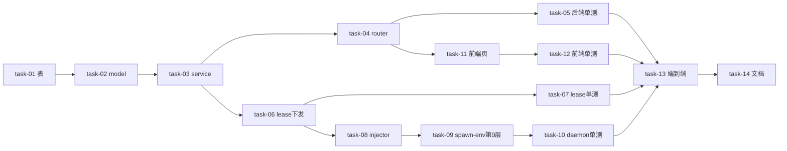

# 实现计划（Plan）— LLM 供应商管理

> 来源：brainstorm 四件套（design.md / decisions.md / requirements.md / tasks.md）+ 原型。本计划把 tasks.md 的任务展开为可执行 Wave，实现细节写到各 `tasks/task-NN.md`（execute 阶段展开）。

## Spike 前置验证

| Spike | 验证内容 | 不通过后果 |
|---|---|---|
| spike-01 | 实测 claude code 是否识别 `ANTHROPIC_DEFAULT_FABLE_MODEL`，以及模型名后缀 `[1m]`（如 `opus[1m]`）是否触发 1M 上下文（X-11 / X-12） | task-08 的 ClaudeCredentialInjector 对 Fable 角色降级——不识别则不注入该角色 env，让其走 `default_fallback_model`（ANTHROPIC_MODEL）；1M 不生效则 one_m 标记仅作 UI 展示。**不阻塞架构**，因 Sonnet/Opus/Haiku 已在 deploy/.env.example 实证 |

> spike-01 在 Wave 3 task-08 实现时顺手做（读 claude code 文档 + 本机起一次 claude 验 env），不需独立 Wave。

---

## Wave 1（后端基础：llm_provider 模块，顺序依赖）

- [x] task-01: 新建 `llm_providers` 表 + alembic migration（含 cc-switch 核心字段 + `encrypted_api_key`/`key_id` + `is_default` + 显式 `created_at`/`updated_at` + 索引；防多 head）（覆盖：FR-01, D-001@v1, D-009@v1, D-010@v1）
- [x] task-02: `LlmProvider` model + schema（Create/Update/Read；含 notes/website_url/auth_field/model_role_mappings/default_fallback_model/extra_env；api_key masked，规则 X-09）（覆盖：FR-01, D-010@v1）
- [x] task-03: `LlmProviderService`（list/get/create/update/delete/set_default + `CredentialCipher` 加解密 + `(user_id, agent_kind)` is_default 互斥 + owner 过滤）（覆盖：FR-01, FR-02, D-001@v1, D-008@v1, D-009@v1）
- [x] task-04: router `/api/llm-providers`（CRUD + set-default）+ `main.py` 挂载（覆盖：FR-01, D-008@v1）
- [x] task-05: 后端单测（CRUD + 加密落盘 + 权限隔离 + is_default 互斥 + masked 不回明文）（覆盖：FR-01, FR-02, FR-07）

## Wave 2（lease 下发，依赖 Wave 1 task-03）

- [x] task-06: `build_claim_payload` 注入 `provider_config`（按 `lease.runtime_id → DaemonRuntime.user_id` 解析默认 provider，interactive 兜底 `session_id → AgentSession.user_id`；agent_kind 归一化 X-08；default_model 落点 X-10）+ lease/execution DTO 加 `provider_config` 字段（覆盖：FR-03, D-002@v1, D-005@v1, D-010@v1）
- [x] task-07: lease 下发单测（有 provider / 无 provider 两路 + agent_kind 归一化 + provider_config 不入审计/submitMessages）（覆盖：FR-03, FR-07）

## Wave 3（daemon 注入器，依赖 Wave 2 task-06 字段契约；与 Wave 4 并行）

- [x] task-08: `credential-injector.ts`（`CredentialInjector` 接口 + `ClaudeCredentialInjector` + 注册表）+ `types.ts` 加 `ProviderConfig`（含 auth_field 选择 / 角色映射→`ANTHROPIC_DEFAULT_{SONNET,OPUS,FABLE,HAIKU}_MODEL` / default_fallback→`ANTHROPIC_MODEL` / extra_env；spike-01 验证 Fable + 1M）（覆盖：FR-04, FR-05, D-004@v1, D-006@v1, D-010@v1, D-011@v1）
- [x] task-09: `spawn-env.ts buildSpawnEnv` 加第 0 层（provider_config → injector → env，最高优先级）+ `redactEnv` 扩展覆盖 provider_config + `daemon.ts` interactive 门控独立化（X-02，不依赖 credentialManager 存在）（覆盖：FR-04, D-007@v1）
- [x] task-10: daemon 单测（injector 角色映射→env + 第 0 层盖过三层 + 脱敏 + 未配 provider 兜底零回归）（覆盖：FR-04, FR-07）

## Wave 4（前端，依赖 Wave 1 task-04 API；与 Wave 3 并行）

- [x] task-11: 设置页「我的供应商」区块（列表 + 新建/编辑表单含模型角色映射表格 + 认证字段下拉 + 自定义 env 键值编辑 + 设默认 + 删除；按前端设计系统 CLAUDE.md 规则19）（覆盖：FR-06, D-002@v1, D-003@v1, D-010@v1）
- [x] task-12: 前端 API 封装（`lib/api/llm-providers.ts`）+ types + 单测（覆盖：FR-06）

## Wave 5（集成 + 文档，依赖 Wave 1–4）

- [x] task-13: 端到端验证（配 provider + 设默认 → 跑 agent → 验证 claude 进程 env 含平台下发值 + 日志脱敏 + 删除/未配时 daemon 走本机 env 零回归）（覆盖：FR-04 全链路, D-007@v1）
- [x] task-14: `local.yaml` 加 `llm_provider` 子模块条目（verify 粒度）+ `.env.example` 补 `SILLYSPEC_MASTER_KEY`（文档债 R-03）+ backend `llm_provider.md` 模块文档（覆盖：D-009@v1 文档债）

---

## 任务总表

| 编号 | 任务 | Wave | 优先级 | 依赖 | 覆盖 FR/D | 说明 |
|---|---|---|---|---|---|---|
| task-01 | llm_providers 表 + migration | W1 | P0 | — | FR-01, D-001, D-009, D-010 | 防多 head；显式时间戳字段 |
| task-02 | model + schema | W1 | P0 | task-01 | FR-01, D-010 | cc-switch 字段全；masked |
| task-03 | service（CRUD+加密+互斥+owner） | W1 | P0 | task-02 | FR-01, FR-02, D-001, D-008, D-009 | 抄 git_identity/service.py 范式 |
| task-04 | router + main.py 挂载 | W1 | P0 | task-03 | FR-01, D-008 | /api/llm-providers |
| task-05 | 后端单测 | W1 | P0 | task-04 | FR-01, FR-02, FR-07 | 权限隔离 + 互斥 + 加密 |
| task-06 | build_claim_payload + DTO | W2 | P0 | task-03 | FR-03, D-002, D-005, D-010 | 按 runtime_id→user 解析 |
| task-07 | lease 下发单测 | W2 | P0 | task-06 | FR-03, FR-07 | 有/无 provider 两路 |
| task-08 | credential-injector + types | W3 | P0 | task-06 | FR-04, FR-05, D-004, D-006, D-010, D-011 | 含 spike-01 |
| task-09 | spawn-env 第0层 + redactEnv + daemon.ts | W3 | P0 | task-08 | FR-04, D-007 | interactive 门控独立 |
| task-10 | daemon 单测 | W3 | P0 | task-09 | FR-04, FR-07 | 优先级 + 脱敏 + 兜底 |
| task-11 | 前端供应商管理页 | W4 | P0 | task-04 | FR-06, D-002, D-003, D-010 | 角色映射表格 + env 编辑器 |
| task-12 | 前端 API + types + 单测 | W4 | P0 | task-11 | FR-06 | lib/api/llm-providers.ts |
| task-13 | 端到端验证 | W5 | P0 | task-05,07,10,12 | FR-04 全链路, D-007 | 配/未配两场景 |
| task-14 | local.yaml + .env.example + 模块文档 | W5 | P1 | task-13 | D-009 文档债 | verify 粒度 + 文档债 |

## 关键路径

`task-01 → task-02 → task-03 → task-06 → task-08 → task-09 → task-13`

（后端表 → model → service → lease 下发字段契约 → daemon injector → spawn-env 第0层 → 端到端集成；Wave 4 前端在 task-04 API ready 后并行推进，Wave 5 汇聚）

## 全局验收标准

- [x] 后端单测通过（task-05）：CRUD + 加密落盘 + owner 权限隔离 + is_default 互斥 + masked 不回明文
- [x] lease 下发单测通过（task-07）：有 provider 注入 provider_config / 无 provider 字段 absent
- [x] daemon 单测通过（task-10）：injector 角色映射→`ANTHROPIC_DEFAULT_*_MODEL`、第 0 层盖过三层、redactEnv 脱敏、未配走本机 env
- [x] 前端单测通过（task-12）
- [x] **brownfield 零回归**：用户未配 provider 时，daemon spawn-env 行为与现状完全一致（第 0 层跳过，三层合并不变）
- [x] 端到端（task-13）：配 provider + 设默认 → claude 进程 env 含平台下发的 `ANTHROPIC_BASE_URL` / 认证 env / 模型映射；api_key 全链路脱敏（不落日志/审计/submitMessages/complete_lease）
- [x] 越权访问返回 403/404（用户只能 CRUD 自己的 provider）
- [x] 三端 lint 通过（backend ruff+mypy / daemon tsc / frontend lint+typecheck）
- [x] spike-01 结论落地：Fable env 与 1M 后缀的识别结果记入 task-08 实现注释

## 覆盖矩阵

| ID | 覆盖任务 | 验收证据 |
|---|---|---|
| D-001@v1（平台 SSOT） | task-01, task-03, task-06 | AC: 加密落盘 + lease 下发明文 api_key |
| D-002@v1（用户级） | task-01, task-03, task-06, task-11 | AC: user_id owner + 按 user 解析默认 |
| D-003@v1（纯自定义） | task-11, task-12 | AC: 表单手填，无预设选择器 |
| D-004@v1（env 注入） | task-08, task-09 | AC: injector.toEnv + 第0层 |
| D-005@v1（lease 下发） | task-06 | AC: provider_config 字段 |
| D-006@v1（agent_kind+injector 抽象） | task-08 | AC: CredentialInjector 接口 + 注册表 |
| D-007@v1（未配兜底） | task-09, task-13 | AC: 第0层 absent 回退 + 端到端零回归 |
| D-008@v1（权限 owner=user） | task-03, task-04 | AC: WHERE user_id 过滤 + 越权 403/404 |
| D-009@v1（复用 crypto+git_identity） | task-01, task-03, task-14 | AC: CredentialCipher + .env.example 补 |
| D-010@v1（cc-switch 核心字段） | task-02, task-08, task-11 | AC: auth_field/角色映射/default_fallback/extra_env 全链路 |
| D-011@v1（角色映射 env） | task-08 | AC: ANTHROPIC_DEFAULT_{ROLE}_MODEL |
| D-012@v1（反代不做） | （边界声明，design §3 非目标） | AC: 字段/schema/UI 均不含反代相关项 |

> 全部 D-001~012 已被任务或边界声明覆盖；P2 细化项 X-08~X-13 已落到对应 task（归一化/落点→task-06，masked→task-02，Fable+1M→task-08 spike-01，interactive 门控→task-09，auth_field 校验→task-02/08）。
