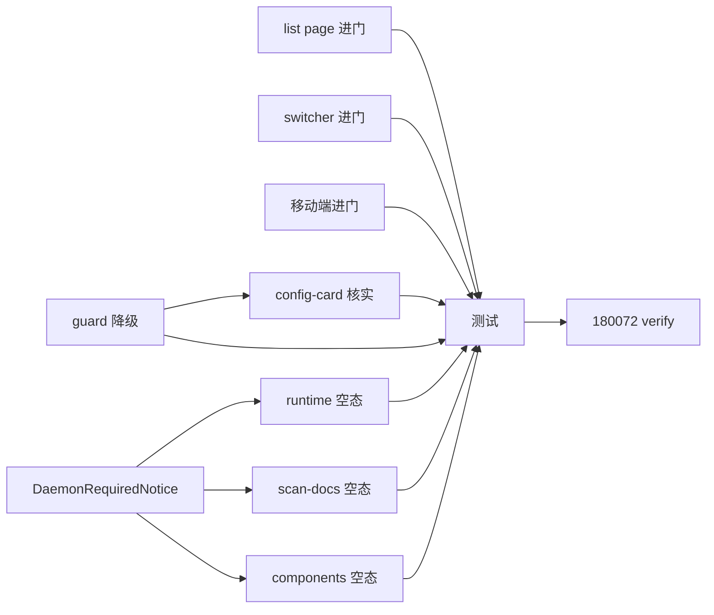

# 实现计划（Plan）— 工作区入口门禁后移

## Spike 前置验证

| Spike | 验证内容 | 不通过后果 |
|---|---|---|
| spike-01 | daemon 依赖页（runtime/scan-docs/components）的精确 daemon 耦合点：哪些 fetch 经 host_fs / daemon 实体，无 binding 时主区是否白屏/报错。核实 design R-01 各页空态接入不漏 | task-06/07/08 接入前必须先核出耦合点；漏页则该页无 binding 仍白屏（execute 自测 + verify 真实点页兜底） |
| spike-02 | 概览 `WorkspaceConfigCard` unbound 渲染：是轻量引导卡还是重型表单占满屏。决定 task-09 是否需收敛 | 不收敛若过重，UX 欠佳但不阻断；task-09 按需收敛 |

## Wave 1（并行，无依赖：进门自由化 + guard 降级 + 空态组件）
- [x] task-01: `workspaces/page.tsx` `handleActivate` 移除未绑定→Dialog 分支（always `router.push`）+ 删 `bindingTarget` state + 列表页 `WorkspaceBindingDialog` 进门用法（覆盖：FR-01, D-001, D-004）
- [x] task-02: `workspace-switcher.tsx` `handleClickEntry` 移除未绑定→Dialog 分支（always `switchWorkspace`）+ 删顶栏 `WorkspaceBindingDialog` 进门用法 + 移除 ql-004 入口点 `canBorrow` 判定（随进门闸移除）（覆盖：FR-01）
- [x] task-03: `m/workspaces/page.tsx` `handleActivate` 移除未绑定→Dialog 分支（always 提示电脑端）（覆盖：FR-01）
- [x] task-04: `workspace-binding-guard.tsx` unbound 不再渲染绑定表单（return null），降级为已绑定编辑入口（覆盖：FR-02, D-004）
- [x] task-05: 新建 `components/daemon-required-notice.tsx`（feature/workspaceId/canBorrow + [配置]/[借用] 按钮，非阻断）+ 单测（覆盖：FR-04, D-003）

## Wave 2（依赖 Wave 1：daemon 依赖页接入空态 + 概览 config-card 核实）
- [x] task-06: `runtime/page.tsx` 先核 daemon 耦合（spike-01），无 binding 主区渲染 `DaemonRequiredNotice`（覆盖：FR-04, R-01）
- [x] task-07: `scan-docs/page.tsx` 同（host_fs 读源码，spike-01）（覆盖：FR-04, R-01）
- [x] task-08: `components/page.tsx` 同（组件拓扑读源码，spike-01）（覆盖：FR-04, R-01）
- [x] task-09: 核实概览 `WorkspaceConfigCard` unbound 渲染（spike-02），过重则收敛为轻量引导（保留配置入口）；复用既有，无新建（覆盖：FR-03, D-002）

## Wave 3（依赖全部：测试 + 真实点页 verify）
- [x] task-10: 各 `__tests__/page.test.tsx` + guard/switcher 测试更新（进门自由化 + guard 降级 + 空态断言 + 移除 ql-004 入口 canBorrow 用例改判进门自由）（覆盖：全局回归）
- [x] task-11: 180072（无 binding 成员）真实点开各页 verify：进门直进（不弹 Dialog）/ 文档类正常 / daemon 依赖页空态 / 概览 config-card（覆盖：FR-01~05 全局验收）

## 任务总表

| 编号 | 任务 | Wave | 优先级 | 依赖 | 覆盖 FR/D | 说明 |
|---|---|---|---|---|---|---|
| task-01 | list page 进门自由化 | W1 | P0 | — | FR-01, D-001 | handleActivate always 导航 |
| task-02 | switcher 进门自由化 | W1 | P0 | — | FR-01 | handleClickEntry always 切换 + 移除 ql-004 canBorrow |
| task-03 | 移动端进门自由化 | W1 | P0 | — | FR-01 | handleActivate always 提示电脑端 |
| task-04 | guard 降级 | W1 | P0 | — | FR-02, D-004 | unbound → null |
| task-05 | DaemonRequiredNotice 组件 | W1 | P0 | — | FR-04, D-003 | 新组件 + 单测 |
| task-06 | runtime 页接入空态 | W2 | P0 | task-05, spike-01 | FR-04, R-01 | 核耦合 + 接入 |
| task-07 | scan-docs 页接入空态 | W2 | P0 | task-05, spike-01 | FR-04, R-01 | host_fs 读源码 |
| task-08 | components 页接入空态 | W2 | P0 | task-05, spike-01 | FR-04, R-01 | 组件拓扑读源码 |
| task-09 | 概览 config-card 核实收敛 | W2 | P1 | task-04, spike-02 | FR-03, D-002 | 复用既有 WorkspaceConfigCard |
| task-10 | 测试更新 | W3 | P0 | 全部 | 全局回归 | 进门/guard/空态断言 |
| task-11 | 180072 真实点页 verify | W3 | P0 | 全部 | FR-01~05 | e2e 兜底 |

## 关键路径

task-01/02/03/04（进门自由化 + guard 降级）→ task-05（空态组件）→ task-06/07/08（daemon 页接入，依赖 spike-01 核耦合）→ task-10/11（测试 + verify）。

task-09（config-card 核实）在 W2，与 task-06/07/08 并行（依赖 task-04 guard 降级 + spike-02）。

## 依赖关系图

## 全局验收标准

- [ ] 所有单元测试通过（进门自由化 / guard 降级 / DaemonRequiredNotice 渲染 / daemon 依赖页空态 / 文档类不受影响）
- [ ] （零回归）已绑定用户：进门导航、guard 编辑入口、跑 agent、借出、scan 行为完全不变
- [ ] 无 binding 成员（如 180072）：点工作区直接进（不弹 Dialog）；文件/变更/成员/知识库正常浏览；runtime/scan-docs/components 显示 DaemonRequiredNotice 空态（非阻断）
- [ ] business_member（已有 daemon:borrow）：进门 + agent 触发借用均正常（ql-004 的入口 canBorrow 移除不回归，因进门自由化对所有成员生效）
- [ ] 纯前端，无后端/schema/API 变更
- [ ] frontend：pnpm lint / typecheck / test 全绿；改 router 跑对应 page.test.tsx

## 覆盖矩阵

| ID | 覆盖任务 | 验收证据 |
|---|---|---|
| D-001 | task-01,02,03 | 进门自由化（成员+平台管理员） |
| D-002 | task-09 | 复用 WorkspaceConfigCard 为可选配置 |
| D-003 | task-05,06,07,08 | daemon 依赖页内联空态（非阻断） |
| D-004 | task-01~11 | 方案 A 门禁后移 + 统一空态 |
| FR-01 | task-01,02,03 | 进门自由化 4 入口 |
| FR-02 | task-04 | guard 降级 |
| FR-03 | task-09 | 概览 config-card（复用） |
| FR-04 | task-05,06,07,08 | DaemonRequiredNotice + 接入 |
| FR-05 | task-11 | 文档类 daemon 无关（verify 点页） |
