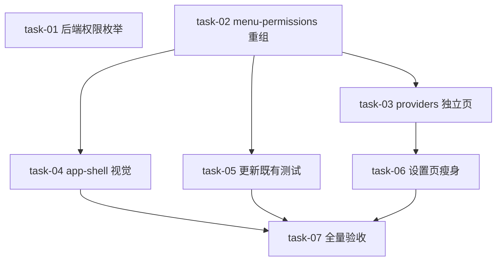

# 实现计划（Plan）— SillyHub 侧边栏菜单信息架构重组

> 技术方案确定（复用现有 `LlmProviderSection` 组件、已知 RBAC 权限模型、已知菜单数据源机制），无技术不确定性，**无需 Spike 前置验证**。

## Wave 1（并行，无依赖）
- [x] task-01: 后端 `permissions.py` 新增 `LLM_PROVIDER_READ` 枚举 + 权限测试（覆盖：FR-05, D-002@v1）
- [x] task-02: `menu-permissions.ts` 重组 + 同步更新 `menu-permissions.test.ts`（覆盖：FR-01, FR-02, FR-03, D-001@v1, D-003@v1, D-006@v1）

## Wave 2（依赖 Wave 1）
- [x] task-03: 我的供应商独立页面 `/settings/providers` + 渲染测试（覆盖：FR-02, D-002@v1）
- [x] task-04: `app-shell.tsx` 视觉统一（图标 + 分组间距 + 高亮）（覆盖：FR-06, D-005@v1）
- [x] task-05: 更新受影响既有测试（`admin-role-permission-picker.test.tsx` + `permission.test.ts`）+ 核对 picker.tsx 新分组渲染（覆盖：FR-01）

## Wave 3（依赖 Wave 2）
- [x] task-06: 设置页瘦身（移除 EntryCard + providers Tab，默认 Tab 改工作区信息）（覆盖：FR-04, D-004@v1）

## Wave 4（依赖 Wave 3）
- [x] task-07: 全量验收（前端受影响测试 + 后端 auth 权限测试 + typecheck）

## 任务总表

| 编号 | 任务 | Wave | 优先级 | 依赖 | 覆盖 FR/D | 说明 |
|---|---|---|---|---|---|---|
| task-01 | 后端 `permissions.py` 新增 `LLM_PROVIDER_READ = "llm_provider:read"` + 权限测试 | W1 | P0 | — | FR-05, D-002@v1 | 枚举单值追加；`seed_platform_admin_role` 启动自动同步，无需 migration |
| task-02 | `menu-permissions.ts` 重组（`MenuSection` 6 值 + 菜单项重排 + 新增 3 菜单项 + SECTION_ORDER/LABEL）+ 更新其测试 | W1 | P0 | — | FR-01/02/03, D-001/003/006@v1 | 核心数据源；权限字符串 `llm_provider:read` 与 task-01 约定一致 |
| task-03 | 我的供应商独立页面 `/settings/providers/page.tsx`（复用 `LlmProviderSection`）+ 渲染测试 | W2 | P0 | task-02 | FR-02, D-002@v1 | 菜单 href 指向此路由；独立直达 |
| task-04 | `app-shell.tsx` 视觉统一（`MENU_ICON_MAP` 补 3 图标 + 分组间距 + 高亮） | W2 | P1 | task-02 | FR-06, D-005@v1 | 新菜单项图标；不动 ppm 隔离/navHidden 逻辑 |
| task-05 | 更新受影响既有测试（`admin-role-permission-picker.test.tsx` 硬编码分组 + `permission.test.ts` 旧 section 名）+ 核对 `admin-role-permission-picker.tsx` 新分组渲染（含我的供应商权限卡片可分配） | W2 | P0 | task-02 | FR-01 | picker.tsx 数据驱动无需改代码，仅核对渲染；测试适配新分组断言 |
| task-06 | 设置页瘦身（移除 4 个 EntryCard + providers Tab + `LlmProviderSection` 引用，默认 Tab 改工作区信息） | W3 | P0 | task-03 | FR-04, D-004@v1 | 依赖 task-03 供应商页面已建，才能移除原 Tab |
| task-07 | 全量验收（前端受影响测试 + 后端 `tests/modules/auth` 权限测试 + typecheck） | W4 | P0 | task-04/05/06 | 全局 | 对照 design 验收 |

## 关键路径

task-02 → task-03 → task-06 → task-07（最长路径，决定最短交付周期）

## 依赖关系图

## 全局验收标准

- [x] 前端受影响测试全部通过（menu-permissions / admin-role-permission-picker / permission / providers / 相关）— 全量 121 文件 1224 tests 绿
- [x] 后端 `tests/modules/auth` 权限测试通过 — 140 passed + 2 xfailed（既有标记）
- [x] 前端 typecheck 通过 — exit 0
- [x] 侧边栏按 5 组渲染（工作区/智能体/配置中心/协作治理/系统管理），守护进程运行时在配置中心组，ppm 组隔离不变
- [x] 我的供应商/技能管理/MCP 管理可从侧边栏直达；我的供应商对 platform admin 可见、未分配 `llm_provider:read` 的角色不可见
- [x] 设置页仅剩 4 个平台配置 Tab（无供应商 Tab、无卡片入口）
- [x] 菜单图标统一为 lucide，无 emoji 残留（icon 字段无渲染消费者，已标注遗留）
- [x] （brownfield）现有路由路径不变；未配置 `llm_provider:read` 时无旧行为破坏

## 覆盖矩阵

| ID | 覆盖任务 | 验收证据 |
|---|---|---|
| D-001@v1 | task-02 | AC：侧边栏 5 组渲染 |
| D-002@v1 | task-01, task-03 | AC：供应商独立页直达 + 权限可分配 |
| D-003@v1 | task-02 | AC：技能/MCP 菜单指向平台级 |
| D-004@v1 | task-06 | AC：设置页 4 Tab 无供应商/卡片 |
| D-005@v1 | task-04 | AC：图标统一 lucide |
| D-006@v1 | task-02 | AC：守护进程运行时在配置中心组 |
| FR-01 | task-02, task-05 | 5 组重组 + 测试适配 |
| FR-02 | task-02, task-03 | 供应商独立菜单直达 |
| FR-03 | task-02 | 技能/MCP 平台级 |
| FR-04 | task-06 | 设置页瘦身 |
| FR-05 | task-01 | 权限枚举 + seed 同步 |
| FR-06 | task-04 | 视觉统一 |
