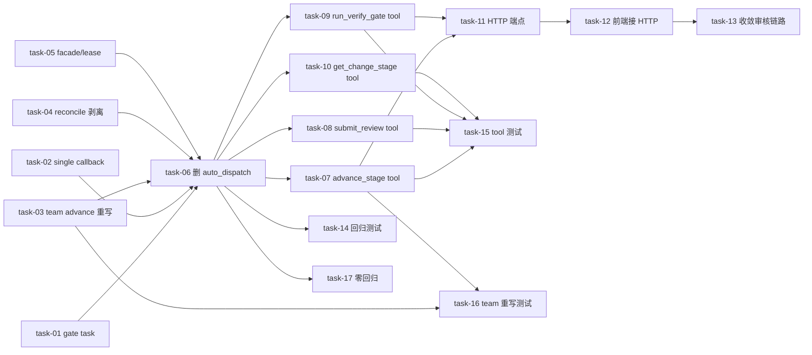

# 实现计划（Plan）— 变更中心按需触发（形态A 减负）

## Spike 前置验证

无强制 Spike。R-04（team 重写）/R-05（回归面）/R-06（gate 时序）是 execute 实测点，非前置 Spike。gate cmd 可达性（run_verify_gate fallback）在 Wave 2 task 实测（gate 子命令发版与否）。

## Wave 1（砍 auto_dispatch + daemon 子域改造，无依赖 — 不同函数/文件）

> ⚠️ task 内依赖：先改 6 调用方（不引用 auto_dispatch_next_step）→ 最后删被调函数（dispatch.py:240）。并行改调用方，删被调放 Wave 1 末。

- [x] task-01: 改 `_run_gate_decision_task`（daemon/run_sync/service.py:1266）只存 gate_result + gate_status=decided + 发 gate_status_changed SSE，**删 :1387 sync_stage_status + auto_dispatch 块**（FR-01/D-001，调用点①）
- [x] task-02: 改 `_trigger_stage_completion_callback` single 分支（run_sync:1550/:1617）删 auto_dispatch，single stage 停"阶段完成待触发" + 发 SSE（FR-01/D-001，调用点③）
- [x] task-03: 重写 `_advance_team_stage`（run_sync:1685）保留 merge_gate_results(:1720) + `complete_stage`(推进 current_stage) + 发 SSE，**删 :1752 auto_dispatch**（FR-05/D-006，调用点④，team 桥）
- [x] task-04: 剥离 `reconcile_stale_runs`（change/dispatch.py:589）:655 auto_dispatch 调用，保留 stale run 清理（释放 has_active_run，FR-07/D-007，调用点⑤）
- [x] task-05: facade（daemon/service.py:458）+ lease（lease/service.py:542）`_trigger_stage_completion_callback` 行为改轻（留痕/发 SSE，不推进）；`converge_mission_for_completed_run`（lease:619）完全保留（FR-01，调用点② facade）
- [x] task-06: **删 `auto_dispatch_next_step`**（change/dispatch.py:240 ~330行）+ 删 `_run_gate_via_delegate` 硬阻塞逻辑下沉（gate 执行移到 run_verify_gate tool，FR-01/D-001/D-003，被调）— **依赖 task-01~05 调用方全改完**

## Wave 2（补 mcp_gateway change 阶层 tool + HTTP 端点，依赖 Wave 1 — 包装的 service 方法在 W1 调整后）

- [x] task-07: `advance_change_stage` MCP tool（包装 `ChangeService.transition_with_dispatch`:721，team 分流 `_dispatch_execute_team`:1130，FR-04/D-004）
- [x] task-08: `submit_stage_review` MCP tool（包装 review 四方法 service.py:1309+，FR-04/D-004）
- [x] task-09: `run_verify_gate` MCP tool（读 `AgentRun.gate_result` / 调 gate cmd 软调用，删 verify-result.md fallback，FR-03/D-003/D-008）
- [x] task-10: `get_change_stage` MCP tool（只读 ChangeService.get + stages + `compute_pending_review`，FR-02/D-002）
- [x] task-11: HTTP 端点（`POST /changes/{id}/advance-stage` + `/run-verify-gate`，前端走 HTTP，FR-06/D-005）

## Wave 3（前端按需触发，依赖 Wave 2 — HTTP 端点就绪）

- [x] task-12: handleDispatch/triggerDispatch（frontend changes/[cid]/page.tsx）接 change 阶层 HTTP 端点（FR-06/D-005）
- [x] task-13: 收敛三条并存审核链路（gate 面板/transition/旧 approval）—— 旧 approval_status/submitReview 退役或明确边界

## Wave 4（测试 + 文档，依赖 Wave 1-3）

- [x] task-14: 砍 auto_dispatch 回归测试改写（test_auto_dispatch_gate / test_gate_retry / test_reconcile_gate，FR-01/R-05）
- [x] task-15: change 阶层 4 tool 测试（test_change_stage_tools.py，FR-04）
- [x] task-16: team 推进重写测试（_advance_team_stage complete_stage + 不 dispatch + advance_change_stage 接 _dispatch_execute_team，FR-05/R-04）
- [x] task-17: single/team 零回归（既有 change/daemon 测试套件，FR 非功能零回归）
- [x] task-18: 模块文档同步（change/daemon/mcp_gateway _module-map + 卡片）

## 任务总表

| 编号 | 任务 | Wave | 优先级 | 依赖 | 覆盖 FR/D |
|---|---|---|---|---|---|
| task-01 | gate task 只存结果 | W1 | P0 | — | FR-01/D-001 |
| task-02 | single callback 删 auto_dispatch | W1 | P0 | — | FR-01/D-001 |
| task-03 | _advance_team_stage 重写 | W1 | P0 | — | FR-05/D-006 |
| task-04 | reconcile 剥离 auto_dispatch | W1 | P0 | — | FR-07/D-007 |
| task-05 | facade/lease callback 改轻 | W1 | P0 | — | FR-01 |
| task-06 | 删 auto_dispatch_next_step + gate 下沉 | W1 | P0 | task-01~05 | FR-01/03/D-001/003 |
| task-07 | advance_change_stage tool | W2 | P0 | task-06 | FR-04/D-004 |
| task-08 | submit_stage_review tool | W2 | P0 | task-06 | FR-04/D-004 |
| task-09 | run_verify_gate tool | W2 | P0 | task-06 | FR-03/08/D-003/008 |
| task-10 | get_change_stage tool | W2 | P1 | task-06 | FR-02/D-002 |
| task-11 | HTTP 端点 | W2 | P1 | task-07/09 | FR-06/D-005 |
| task-12 | 前端 handleDispatch 接 HTTP | W3 | P1 | task-11 | FR-06/D-005 |
| task-13 | 收敛审核链路 | W3 | P2 | task-12 | FR-06 |
| task-14 | 回归测试改写 | W4 | P0 | task-06 | FR-01/R-05 |
| task-15 | change 阶层 tool 测试 | W4 | P0 | task-07~10 | FR-04 |
| task-16 | team 重写测试 | W4 | P0 | task-03/07 | FR-05/R-04 |
| task-17 | single/team 零回归 | W4 | P0 | task-01~06 | 非功能 |
| task-18 | 模块文档同步 | W4 | P1 | task-01~13 | 文档 |

## 关键路径

task-01~05（改调用方，并行）→ task-06（删被调）→ task-07/09（核心 tool）→ task-11（HTTP）→ task-12（前端）→ task-16（team 重写测试，R-04 关键验证）。

**team 推进闭环关键验证**：task-03（_advance_team_stage 重写）+ task-07（advance_change_stage tool 接 _dispatch_execute_team）+ task-16（测试 team execute→verify→archive 按需流转）。

## 依赖关系图

## 全局验收标准

- [ ] auto_dispatch_next_step 删除，6 调用点全改造，无运行时 ImportError/AttributeError（task-01~06）
- [ ] change 阶层 4 MCP tool + HTTP 端点按需触发（task-07~11）
- [ ] team 模式 execute→verify→archive 按需流转通（_advance_team_stage 重写 + advance_change_stage 接 _dispatch_execute_team，task-03/07/16）
- [ ] gate 软调用（run_verify_gate）不硬阻塞，结果交决策（task-09）
- [ ] single/team 零回归（除 stage 推进改按需，task-17）
- [ ] dispatch-worker（2026-08-08）零影响（执行层不碰 change.current_stage）
- [ ] 既有测试不破坏（砍 auto_dispatch 测试改写 task-14，新 tool/team 测试 task-15/16）
- [ ] 模块文档同步（task-18）

## 覆盖矩阵

| ID | 覆盖任务 | 验收证据 |
|---|---|---|
| D-001 砍 auto_dispatch | task-01~06 | 6 调用点改 + 删被调，无 ImportError |
| D-002 sillyspec.db 同步废弃 | task-10 | get_change_stage tool 按需查 |
| D-003 gate 软调用 | task-06/09 | run_verify_gate 读 gate_result/gate cmd |
| D-004 4 change 阶层 tool | task-07~10 | 4 tool + 测试 task-15 |
| D-005 前端按需触发 | task-11/12 | HTTP 端点 + handleDispatch 接 |
| D-006 team 重写 | task-03/07/16 | _advance_team_stage 重写 + 测试 |
| D-007 reconcile 剥离 | task-04 | 剥离 :655 + 保留清理 |
| D-008 gate fallback daemon 可达 | task-09 | 删 verify-result.md，读 gate_result/cmd |
