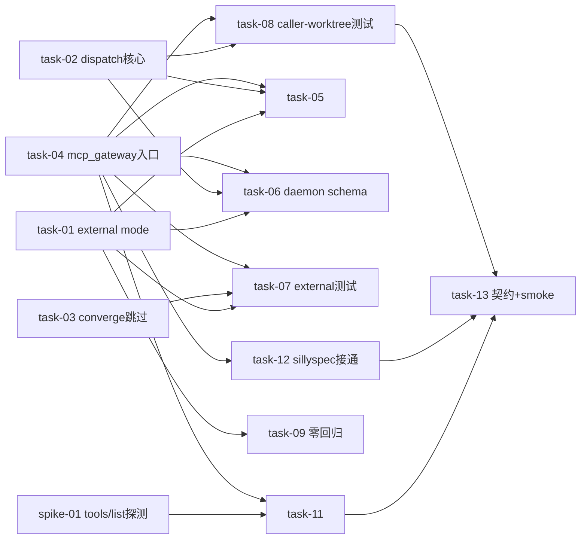

# 实现计划（Plan）— dispatch_worker caller worktree（路径A）+ mission external 模式

## Spike 前置验证

| Spike | 验证内容 | 不通过后果 |
|---|---|---|
| spike-01 | SillyHub public MCP gateway（mcp_gateway FastMCP）支持 MCP 标准 `tools/list`；sillyspec `client.js` 持 McpToken 能鉴权调通；`dispatch_worker`/`create_mission` 的 optional 字段（worktree_path/orchestration_mode）真入 inputSchema（R-04） | `isPathASupported` 探测方案改：用 env 标记 `SILLYHUB_PATH_A=1` 替代 schema 探测（task-11 重设计） |

> spike-01 在 Wave 5（跨仓接通）前跑，因为它决定 isPathASupported 探测可行性。其余风险（R-01 三重防御、R-03 allowed_roots）是 execute 实测点，不是前置 Spike。

## Wave 1（SillyHub 后端核心，并行无依赖 — 不同函数/文件）

- [x] task-01: orchestrator.py team_mission_entry 支持 orchestration_mode="external"（跳过 orchestrator run/lease + constraints 存 mode + 返回类型 tuple[AgentMission, AgentRun|None]）（覆盖：FR-08, D-007, P1 external 返回构造）
- [x] task-02: execution.py dispatch_worker 加 worktree_path/branch/worker_prompt 三可选参 + :190 自建短路 `and not worktree_path` + 路径A 不写 run.worktree_branch + :245 prompt 覆写（覆盖：FR-01, FR-02, FR-03, FR-10, D-001, D-008, D-009）
- [x] task-03: finalizer.py converge_mission_for_completed_run 检测 mission.constraints.orchestration_mode=="external" → 跳过 finalize/cleanup（:501 后插短路）（覆盖：FR-09, D-003@v2, R-01 根解）
- [x] task-04: mcp_gateway/tools.py create_mission 加 orchestration_mode 参 + dispatch_worker 加3参透传（链路B）（覆盖：FR-01, FR-08, D-007）

## Wave 2（链路A HTTP + daemon schema，依赖 Wave 1 — 入口调 execution）

- [x] task-05: router.py:847 create_mission HTTP 端点 + mcp_tools.py DispatchWorkerRequest(:56) 加对应字段（链路A HTTP；P2 校正：create_mission HTTP 实际在 router.py:847 非 mcp_tools.py）（覆盖：FR-01, FR-08）
- [x] task-06: sillyhub-daemon mcp-server.ts(:154) + hub-client.ts(:1039) createMission/dispatchWorker inputSchema+body 加字段（链路A daemon stdio）（覆盖：FR-01, FR-08, R-06）

## Wave 3（测试，依赖 Wave 1-2）

- [x] task-07: 新增 test_mission_external_mode.py（create_mission external → 无 orchestrator run + constraints 含 mode；converge external → 跳过 finalize）（覆盖：AC-04, AC-05, R-01, R-02）
- [x] task-08: 新增 test_dispatch_worker_caller_worktree.py（传 worktree_path → 不调 git_worktree_add + root_path 透传 + 不写 run.worktree_branch + worker_prompt 进 prompt；mcp_gateway 入口透传）（覆盖：AC-01, AC-03）
- [x] task-09: 全套零回归（test_dispatch_worker_worktree AC-01..06 / test_mcp_tools / test_execution / team 模式 create_mission 全绿）（覆盖：AC-02, FR-05）

## Wave 4（allowed_roots 文档/校验，与 Wave 3 并行 — 纯文档）

- [x] task-10: docs 集成指引（workspace root_path=仓根 + daemon allowed_roots 配置约定）+ smoke 前置硬校验脚本（allowed_roots 含仓根）（覆盖：FR-06, R-03）

## Wave 5（跨仓 SillySpec 接通，依赖 Wave 1-4 + spike-01）

> **DESCOPED（2026-08-08 用户决策 + design §10 R-08 两仓解耦）**：Wave 5 task-11/12/13 属跨仓 sillyspec 仓改动（allowed_paths 全在 sillyspec/src + sillyspec/docs）+ 端到端 live smoke（需运行 SillyHub backend+daemon）。按 R-08「SillyHub 先落地，SillySpec 探测随后翻真」，本变更交付 SillyHub 路径A 后端（Waves 1-4，task-01..10），Wave 5 转独立 sillyspec 变更处理（走 sillyspec 自身流程 + 服务就绪后跑 smoke）。本仓链路B tools/list 已暴露 dispatch_worker schema（探测可达性基础设施就绪）。task-11/12/13 review.json 标 cannot_verify + requiredEvidence（指向独立 sillyspec 变更）。

- [x] task-11: sillyspec isPathASupported() 改为探测 MCP tools/list dispatch_worker schema 含 worktree_path（spike-01 通过后；不通过改 env 标记）（覆盖：FR-04, D-005, AC-07）
- [x] task-12: sillyspec client.js createMission 传 orchestration_mode="external" + dispatchWorker 传 branch（字段名对齐）+ probe.js rootPath 拿取/越界校验（覆盖：FR-04, D-006, D-009）
- [x] task-13: 跨仓契约 docs/sillyspec/sillyhub-path-a-contract.md 更新（字段名 branch + external mode + 校验清单打勾）+ 端到端 smoke（某仓 SillySpec execute → create_mission(external) → dispatch_worker → worker 写码 → 回收 apply）（覆盖：FR-07, AC-08）

## 任务总表

| 编号 | 任务 | Wave | 优先级 | 依赖 | 覆盖 FR/D | 说明 |
|---|---|---|---|---|---|---|
| spike-01 | MCP tools/list 探测可行性验证 | 前置 | P0 | — | FR-04, D-005 | 决定 task-11 探测方案 |
| task-01 | team_mission_entry external mode | W1 | P0 | — | FR-08, D-007 | P1 external 返回构造落实 |
| task-02 | dispatch_worker 路径A 核心 | W1 | P0 | — | FR-01/02/03/10, D-001/008/009 | 不写 worktree_branch |
| task-03 | converge external 跳过 | W1 | P0 | — | FR-09, D-003@v2 | R-01 根解 |
| task-04 | mcp_gateway 入口加参（链路B） | W1 | P0 | — | FR-01/08, D-007 | SillySpec 走这条 |
| task-05 | 链路A HTTP 入口加参 | W2 | P1 | task-01/02/04 | FR-01/08 | router.py:847 |
| task-06 | daemon mcp-server/hub-client schema | W2 | P1 | task-01/02/04 | FR-01/08, R-06 | 链路A daemon stdio |
| task-07 | test_mission_external_mode | W3 | P0 | task-01/03/04 | AC-04/05, R-01/02 | external 闭环验证 |
| task-08 | test_dispatch_worker_caller_worktree | W3 | P0 | task-02/04 | AC-01/03 | caller-worktree 分支 |
| task-09 | 全套零回归 | W3 | P0 | task-01..06 | AC-02, FR-05 | team 模式字节不变 |
| task-10 | allowed_roots 文档+校验 | W4 | P1 | — | FR-06, R-03 | 纯文档/脚本 |
| task-11 | isPathASupported 探测 | W5 | P0 | spike-01, task-04 | FR-04, D-005, AC-07 | 跨仓 sillyspec |
| task-12 | sillyspec client/probe 接通 | W5 | P0 | task-04 | FR-04, D-006/009 | 跨仓 sillyspec |
| task-13 | 契约更新 + 端到端 smoke | W5 | P0 | task-01..12 | FR-07, AC-08 | 最终验收 |

## 关键路径

spike-01 → task-02/04（核心 dispatch+入口）→ task-06（daemon schema）→ task-08（caller-worktree 测试）→ task-12（sillyspec 接通）→ task-13（端到端 smoke）

P0-1（merge 污染）三重防御闭环的关键验证：task-02（不写 worktree_branch）+ task-03（converge 跳过）+ task-07（external 闭环单测）+ task-13（端到端实测 worker 终态不污染主仓）。

## 依赖关系图

## 全局验收标准

- [ ] 所有单元测试通过（task-07/08/09 + 既有套件）
- [ ] **集成冒烟（P0-1/P0-2 关键）**：端到端 smoke（task-13/AC-08）实测——SillySpec execute 派 worker 到 caller worktree，worker 终态后 SillyHub **不 merge 不污染主仓**（三重防御：external converge 跳过 + 不写 worktree_branch + worker_prompt 不 commit）
- [ ] （brownfield）orchestration_mode 默认 team + dispatch 三参默认 None + converge external 默认不命中 → team 模式 / 既有 create_mission/dispatch_worker 调用方字节不变（task-09/AC-02）
- [ ] spike-01 通过（tools/list 探测可行）或 task-11 改 env 标记方案
- [ ] daemon allowed_roots 含仓根（task-10 前置校验）

## 覆盖矩阵

| ID | 覆盖任务 | 验收证据 |
|---|---|---|
| D-001@v1 | task-02 | AC-01（worker_prompt 覆写） |
| D-002@v1 | task-01/02 | 不新增列（constraints JSON 复用） |
| D-003@v2 | task-03 | AC-05（converge external 跳过） |
| D-004@v1 | task-13 | AC-08（SillySpec 自己 apply） |
| D-005@v1 | task-11 | AC-07（探测 schema） |
| D-006@v1 | task-12/13 | 跨仓接通 |
| D-007@v1 | task-01/04 | AC-04（external 无 orchestrator） |
| D-008@v1 | task-02 | AC-01（不写 worktree_branch） |
| D-009@v1 | task-02/04/06/12 | 字段名 branch 对齐 |
