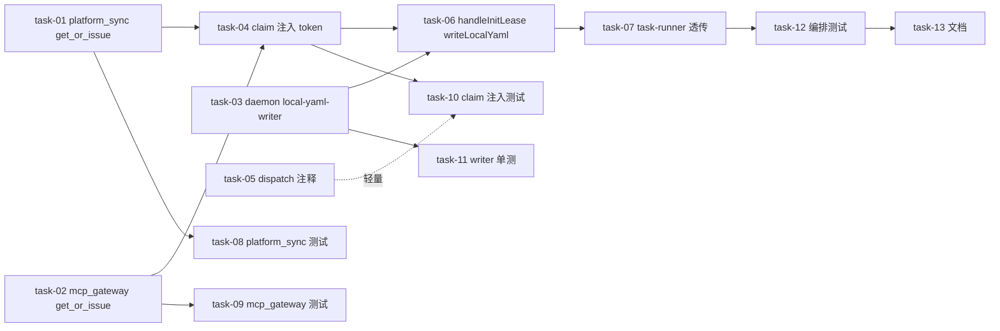

# 实现计划（Plan）

> design 已终审 pass（brainstorm docHash 2e231bf0），本 plan 据其 §6 文件清单 + tasks.md 草案拆 Wave。
> 无技术不确定性（复用既有 token service / claim payload 透传 / sillyspec sync.js 成熟算法），**不需要 Spike**。

## Wave 1（并行，无依赖——三块独立可并行）
- [x] task-01: PlatformSyncTokenService.get_or_issue（覆盖：FR-01, FR-02, FR-03, D-001）
- [x] task-02: McpTokenService.get_or_issue（覆盖：FR-01, FR-02, FR-08, D-001）
- [x] task-03: daemon local-yaml-writer.ts 文本级段替换工具（覆盖：FR-04, FR-05, FR-06, D-004）

## Wave 2（依赖 Wave 1 的 task-01/02）
- [x] task-04: build_claim_payload init 分支注入 token（覆盖：FR-01, FR-03, D-002）
- [x] task-05: start_init_dispatch 注释澄清 actor_user_id 落 metadata（覆盖：FR-03, D-002）

## Wave 3（依赖 Wave 2 的 task-04 + Wave 1 的 task-03）
- [x] task-06: handleInitLease 增 writeLocalYaml 第 4 步（覆盖：FR-04, FR-05, FR-06, FR-07, D-003）
- [x] task-07: task-runner 透传 local_yaml + serverOrigin 到 handleInitLease（覆盖：FR-06）

## Wave 4（测试全覆盖，依赖 Wave 1-3 实现）
- [x] task-08: platform_sync get_or_issue 测试（覆盖：FR-02）
- [x] task-09: mcp_gateway get_or_issue 测试（覆盖：FR-02, FR-08）
- [x] task-10: claim 阶段 token 注入测试 + start_init_dispatch 防回退测试（覆盖：FR-01, FR-03, D-002）
- [x] task-11: local-yaml-writer 单元测试（覆盖：FR-04, FR-05）
- [x] task-12: handleInitLease 编排测试（含失败语义）（覆盖：FR-07, D-003）

## Wave 5（收尾）
- [x] task-13: 模块文档同步 + local.yaml 段注释（覆盖：非功能-兼容性/可维护性）

## 任务总表

| 编号 | 任务 | Wave | 优先级 | 依赖 | 覆盖 FR/D | 说明 |
|---|---|---|---|---|---|---|
| task-01 | PlatformSyncTokenService.get_or_issue | W1 | P0 | — | FR-01,02,03, D-001 | 内联 select+UPDATE 吊销，不新增 public revoke |
| task-02 | McpTokenService.get_or_issue | W1 | P0 | — | FR-01,02,08, D-001 | 复用三件套，scope=['dispatch'] |
| task-03 | daemon local-yaml-writer.ts | W1 | P0 | — | FR-04,05,06, D-004 | TS 重写 sync.js 段替换算法 |
| task-04 | build_claim_payload 注入 token | W2 | P0 | task-01,02 | FR-01,03, D-002 | claim 时现算注入，不落 lease.metadata |
| task-05 | start_init_dispatch 注释澄清 | W2 | P1 | — | FR-03, D-002 | 零行为改动，确保 actor_user_id 已落 metadata |
| task-06 | handleInitLease 增 writeLocalYaml | W3 | P0 | task-03,04 | FR-04,05,06,07, D-003 | 第4步 try/catch 返 ok:false |
| task-07 | task-runner 透传 local_yaml+serverOrigin | W3 | P0 | task-06 | FR-06 | serverOrigin=task-runner.config.server_url |
| task-08 | platform_sync get_or_issue 测试 | W4 | P0 | task-01 | FR-02 | 空/有旧/不堆积/吊销后 None |
| task-09 | mcp_gateway get_or_issue 测试 | W4 | P0 | task-02 | FR-02,08 | 同上 + scope 合法性 |
| task-10 | claim 注入 + dispatch 防回退测试 | W4 | P0 | task-04,05 | FR-01,03, D-002 | payload 含明文、不落 metadata、dispatch 不签 token |
| task-11 | local-yaml-writer 单元测试 | W4 | P0 | task-03 | FR-04,05 | 覆盖/有才留/注释/CRLF/不存在创建/段边界 |
| task-12 | handleInitLease 编排测试 | W4 | P0 | task-06,07 | FR-07, D-003 | 写成功/写失败 ok:false→failed/url 用 serverOrigin |
| task-13 | 模块文档同步 | W5 | P2 | task-01~07 | 非功能 | platform_sync/mcp_gateway/agent/daemon 文档 + local.yaml 范本注释 |

## 关键路径

task-01/02 → task-04 → task-06 → task-12（后端签发→claim 注入→daemon 写盘→编排测试，最长链，决定交付周期）
task-03 → task-06（daemon writer 并行支线，汇入 task-06）

## 全局验收标准

- [ ] `cd backend && uv run pytest app/modules/platform_sync app/modules/mcp_gateway app/modules/daemon -q --no-cov` 全绿（module 策略命中 platform_sync/mcp_gateway/daemon）
- [ ] `cd sillyhub-daemon && pnpm exec vitest run`（按 local.yaml sillyhub-daemon 模块规则：主批排除 3 个并发 flaky 用例 + maxForks=1 独跑这 3 个）全绿
- [ ] `cd backend && uv run ruff check . && uv run ruff format --check . && uv run mypy app` 无新增错误
- [ ] `cd sillyhub-daemon && pnpm typecheck` 无新增错误
- [ ] 集成冒烟：手动跑一次 init（本机 daemon 在线），验证成员本地 .sillyspec/local.yaml 两段被正确写入、token 为 shpsync_/shmcp_ 前缀、sillyspec sync 可推送进度（组件单测全绿 ≠ 集成正确，跨进程 lease 链路必须实测）
- [ ] 安全核验：grep lease.metadata_ 写入点，确认明文 token 不落库；DB 查 daemon_task_leases.metadata 无 platform_token/mcp_token 明文
- [ ] （brownfield 回归）未触发 init 的 workspace 行为零不变；用户已手填 mcp 段的 local.yaml，init 后 mcp 段原样保留

## 覆盖矩阵（decisions）

| ID | 覆盖任务 | 验收证据 |
|---|---|---|
| D-001（token 复用=吊销旧+签新） | task-01, task-02, task-08, task-09 | get_or_issue 内联吊销/复用三件套 + 测试覆盖不堆积 |
| D-002（明文不落 lease.metadata，claim 时注入） | task-04, task-05, task-10 | build_claim_payload claim 时注入 + 安全核验 grep/DB 查 |
| D-003（写 local.yaml 失败=init failed） | task-06, task-12 | handleInitLease 第4步 ok:false → _finish(false) + 编排测试 |
| D-004（platform 覆盖、mcp 有才留） | task-03, task-11 | writeLocalYaml 段替换逻辑 + 单元测试覆盖两段行为 |
| D-005（不动 sillyspec 工具仓） | 全部 | allowed_paths 仅 backend/ + sillyhub-daemon/，无 sillyspec/ |

## 生产接线路径说明

- 本次不涉及 design 提到的入口文件（backend main.py / daemon cli.ts）改动——init 入口路由 `POST /workspaces/{id}/init` 已存在（router.py:256），claim 端点已存在，task 的 allowed_paths 只含具体改动文件，**不需**含入口文件。
- daemon 侧 task-runner.ts / spec-sync.ts 是既有被调用模块，非入口，allowed_paths 含它们即可。
