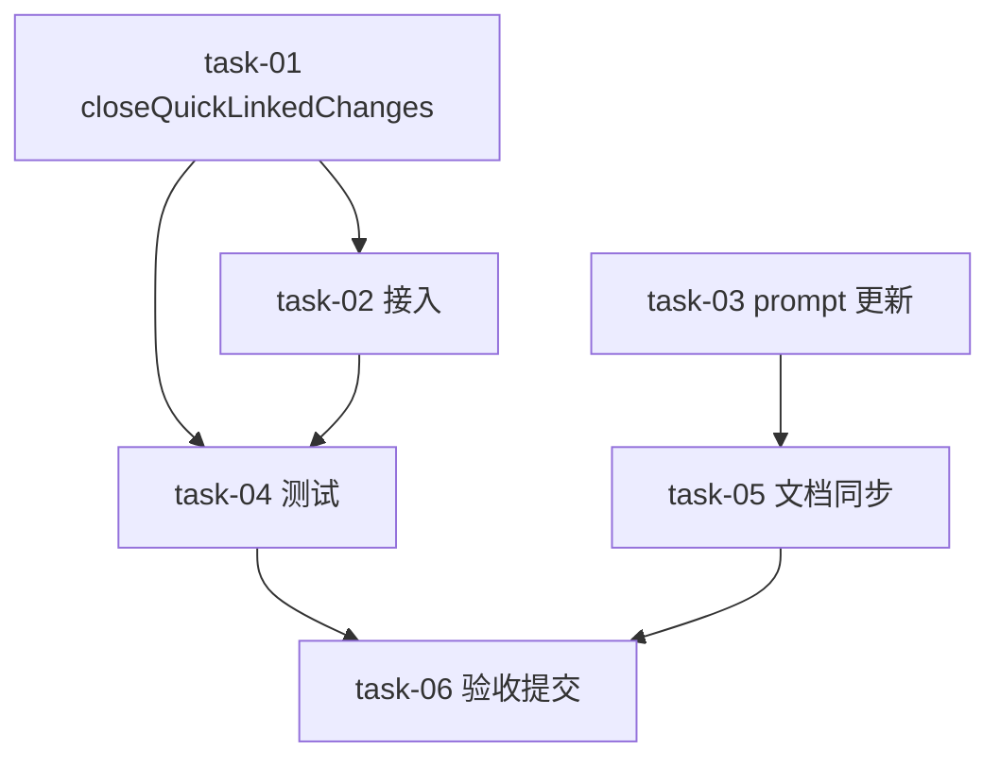

# 实现计划（Plan）：quick 完成时自动关闭关联真实变更

## 来源

直接引用 brainstorm 结论：quick --done 完成后，对 `guard.linkedChanges` 中的真实变更，当其 `tasks.md` 全勾选时执行轻量归档（`unregisterChange` + 目录移动到 `changes/archive/`）。

## Spike 前置验证

无需 Spike。设计已明确：复用现有 `archiveDestDirName`、`archiveWorktreeCleanup`、`renameSyncRetry`、`safeGit`、`unregisterChange`，新增 `closeQuickLinkedChanges` 函数。

## Wave 1：核心实现（无外部依赖）

- [x] task-01: `src/run/complete-handlers.js` 实现 `closeQuickLinkedChanges` 与辅助函数 `isChangeTasksComplete` / `closeSingleQuickLinkedChange`
  - 覆盖：FR-01, FR-02, FR-03, FR-05, FR-06, D-001@v1, D-002@v1, D-003@v1
  - 说明：复用现有归档工具；跳过 plan.md 硬校验；单个变更归档失败 warn 不阻断。
- [x] task-03: `src/stages/quick.js` step3 prompt 增加“关联变更全完成时 CLI 自动归档”说明
  - 覆盖：FR-07
  - 说明：改提示词后需重跑 `node docs/prompt/_extract.mjs`。

## Wave 2：接入与文档同步（依赖 Wave 1）

- [x] task-02: `handleQuickStageCompletion` 在 quick --done 末尾接入 `closeQuickLinkedChanges`
  - 覆盖：FR-01
  - 依赖：task-01
  - 说明：在 `completeQuicklogEntry` 之后、`unregister quick-<hex>` 之前调用。
- [x] task-05: 文档同步
  - 覆盖：FR-08
  - 依赖：task-03
  - 说明：`docs/sillyspec/file-lifecycle.md`；重跑 `node docs/prompt/_extract.mjs` 刷新 `docs/prompt/quick.md` + `_extracted.json`；按需同步 `.claude/skills/sillyspec-quick/SKILL.md`。

## Wave 3：测试（依赖 Wave 2）

- [x] task-04: 新增 `test/quick-close-linked-changes.test.mjs`
  - 覆盖：FR-02, FR-03, FR-04, NFR-03
  - 依赖：task-01, task-02
  - 说明：覆盖自动归档、未完成任务不误关、目标目录已存在幂等、无 linkedChanges 零回归。

## Wave 4：验收与收尾（依赖 Wave 3）

- [x] task-06: 跑 `npm test` + `npm run lint`，精修 QUICKLOG 并提交
  - 覆盖：AC-04, AC-05
  - 依赖：task-04, task-05
  - 说明：以落盘文件与测试结果为准；提交前查 git status 首列隔离他人暂存。

## 任务总表

| 编号 | 任务 | Wave | 优先级 | 依赖 | 覆盖 FR/D | 说明 |
|---|---|---|---|---|---|---|
| task-01 | closeQuickLinkedChanges 函数实现 | 1 | P0 | - | FR-01~03,05~06, D-001~003 | 核心归档逻辑 |
| task-03 | quick.js step3 prompt 更新 | 1 | P1 | - | FR-07 | 提示词同步 |
| task-02 | handleQuickStageCompletion 接入 | 2 | P0 | task-01 | FR-01 | 调用点 |
| task-05 | 文档同步 | 2 | P1 | task-03 | FR-08 | file-lifecycle + prompt + skill |
| task-04 | 新增测试 | 3 | P0 | task-01,02 | FR-02~04, NFR-03 | 回归覆盖 |
| task-06 | 验收与提交 | 4 | P0 | task-04,05 | AC-04,05 | test + lint |

## 验收标准

- AC-01: 关联变更 `tasks.md` 全勾选时，quick --done 后该变更 `changes.status = archived` 且目录移到 `changes/archive/<date>-<desc>/`。
- AC-02: 关联变更仍有未完成任务时，quick --done 后保持 active 并打印提示。
- AC-03: 无 `linkedChanges` 的 quick 行为零回归。
- AC-04: `npm test` 全绿 + `npm run lint` 全绿。
- AC-05: `file-lifecycle.md` / prompt 镜像 / skill 同步完成。

## 依赖图

## 决策覆盖矩阵

| ID | 覆盖任务 | 验收证据 |
|---|---|---|
| D-001@v1 | task-01, task-02 | AC-01 |
| D-002@v1 | task-01 | AC-02 |
| D-003@v1 | task-01 | AC-01（轻量归档不校验 plan.md） |

## 风险与缓解

- 并发会话：task-01 实现中 `isChangeTasksComplete` 作为硬闸门，task-04 补并发场景测试。
- 目标目录冲突：task-01 移动前检查 `existsSync(destDir)`。
- 文档同步遗漏：task-05 用 checklist 逐项确认。
