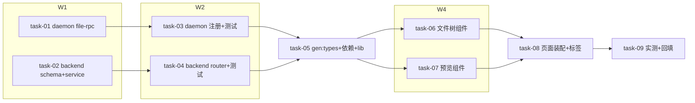

# 实现计划（Plan）— 工作区文件浏览器（只读）

## Spike 前置验证

无 Spike。技术方案全部基于既有成熟模式：WS RPC 转发（list_dir 先例）、antd Tree 懒加载（RemoteFolderPicker 先例）、react-syntax-highlighter 成熟库；剩余不确定性（Windows 大仓库搜索耗时、10MB 经 WS 传输）已定风险兜底（60s 超时+截断+实测任务 task-09），不需要前置验证。

## Wave 1（并行，无依赖）
- [x] task-01: daemon file-rpc.ts 新增 explorerListDir/explorerReadFile/explorerSearch 三函数 + EXPLORER 常量（覆盖：FR-01, FR-02, FR-04, FR-05, D-002@v1, D-004@v1, D-005@v1）
- [x] task-02: backend explorer 模块 schema.py + service.py + __init__.py（绑定解析复用 MemberBindingResolver + 跨平台 containment 预检 + WS RPC 转发 + 错误映射）（覆盖：FR-01, FR-05, FR-06, D-001@v1, D-002@v1, D-003@v1）

## Wave 2（依赖 Wave 1）
- [x] task-03: daemon.ts 注册 explorer_* 三 handler + daemon 侧测试（realpath 逃逸/截断/二进制/base64/搜索上限/噪声排除矩阵）（覆盖：FR-01, FR-05, FR-06；depends: task-01）
- [x] task-04: backend explorer router.py 四端点 + main.py 挂载 + backend 测试（containment 拒绝矩阵/绑定解析/错误映射/download 头）（覆盖：FR-01, FR-02, FR-03, FR-04, FR-06；depends: task-02）

## Wave 3（依赖 Wave 2）
- [x] task-05: pnpm gen:types 同步 openapi.json + api-types.ts + frontend 引入 react-syntax-highlighter 依赖 + lib/explorer.ts fetch 封装（depends: task-04）

## Wave 4（并行，依赖 Wave 3）
- [x] task-06: frontend file-explorer.tsx 组件（antd Tree 懒加载 + 文件名搜索 + 祖先链逐层展开直达）+ 组件测试（覆盖：FR-01, FR-04, D-005@v1）
- [x] task-07: frontend file-preview.tsx 组件（代码高亮/Markdown/图片 blob/元信息卡 + 下载按钮）+ 组件测试（覆盖：FR-02, FR-03, D-004@v1）

## Wave 5（依赖 Wave 4）
- [x] task-08: explorer page.tsx 页面装配（左树右预览 + 三降级态：离线/未绑定/版本过低）+ workspace-tabs.tsx 加「文件」标签 + 页面级测试（depends: task-06, task-07）
- [x] task-09: 真实仓库全链路实测（搜索耗时记录 / 10MB 文件 download / 三降级态触发验证）+ 结果回填 design R-03/R-04 备注（depends: task-08）

## 任务总表

| 编号 | 任务 | Wave | 优先级 | 依赖 | 覆盖 FR/D | 说明 |
|---|---|---|---|---|---|---|
| task-01 | daemon file-rpc 三函数+常量 | W1 | P0 | — | FR-01/02/04/05, D-002/004/005 | realpath+allowed_roots 双校验、10MB 截断、encoding 参数 |
| task-02 | backend schema+service | W1 | P0 | — | FR-01/05/06, D-001/002/003 | 复用 MemberBindingResolver，PureWin/PurePosix 预检 |
| task-03 | daemon.ts 注册+测试 | W2 | P0 | task-01 | FR-01/05/06 | 不照抄裸 list_dir 空 roots 写法 |
| task-04 | backend router+挂载+测试 | W2 | P0 | task-02 | FR-01/02/03/04/06 | 四端点显式超时 30/30/60/60s |
| task-05 | gen:types+前端依赖+lib 封装 | W3 | P0 | task-04 | FR-01~04 前置 | openapi/api-types/包依赖/explorer.ts |
| task-06 | 文件树+搜索组件 | W4 | P0 | task-05 | FR-01/04, D-005 | loadData 懒加载+祖先链直达 |
| task-07 | 文件预览组件 | W4 | P0 | task-05 | FR-02/03, D-004 | 高亮/MD/图片/下载分发 |
| task-08 | 页面装配+标签+降级态 | W5 | P0 | task-06,07 | FR-01~06 集成 | 集成冒烟：三降级态+全链路 |
| task-09 | 真实仓库实测+风险回填 | W5 | P1 | task-08 | R-03/R-04 兜底 | 实测数据回填 design |

## 关键路径

task-02 → task-04 → task-05 → task-06/07 → task-08 → task-09（backend 链最长，决定交付周期；daemon 链 task-01 → task-03 与之并行汇合于 task-05 后的联调）

## 依赖关系

## 全局验收标准

- [ ] daemon/backend/frontend 三端测试全绿（local.yaml test 命令：backend `uv run pytest -q` + frontend `pnpm test` + daemon `pnpm test`）
- [ ] lint 三端通过（backend ruff+mypy / frontend pnpm lint / daemon typecheck）
- [ ] 路径穿越矩阵（`../`、绝对路径、UNC、工作区内 symlink 指外）全部被拒且各有测试用例
- [ ] 集成冒烟（task-08）：登录后工作区「文件」标签可见、树可展开、文件可预览可下载、搜索可用
- [ ] 三降级态（daemon 离线/未绑定/版本过低）真实触发验证（task-09）
- [ ] brownfield 兼容：未升级 daemon 的环境其它功能不受影响；既有 list_dir 裸 RPC 行为不变
- [ ] api-types.ts 与 openapi.json 同步提交（gen:types 产物一并入库）

## 覆盖矩阵

| ID | 覆盖任务 | 验收证据 |
|---|---|---|
| D-001@v1 | task-02, task-04 | 全链路实时转发无平台存储，验收=集成冒烟 |
| D-002@v1 | task-01, task-03, task-04 | explorer_* RPC + method_not_found→422 映射测试 |
| D-003@v1 | task-02 | resolve_member_binding_or_none 复用 + 404 测试 |
| D-004@v1 | task-01, task-07 | 10MB 截断 + download 强制 base64 测试 |
| D-005@v1 | task-01, task-06 | 文件名搜索上限 100 + truncated 测试 |
