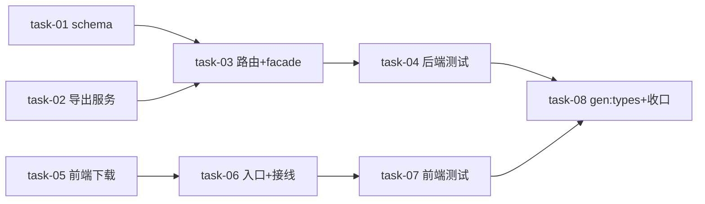

# 实现计划（Plan）— 会话一键导出

## Wave 1（并行，无依赖——契约已由 design.md 固定）
- task-01
- task-02
- task-05

## Wave 2（依赖 Wave 1 对应任务）
- task-03
- task-06

## Wave 3（测试）
- task-04
- task-07

## Wave 4（收口）
- task-08

## 任务总表
| 编号 | 任务 | Wave | 优先级 | 依赖 | 覆盖 FR/D | 说明 |
|---|---|---|---|---|---|---|
| task-01 | 后端 schema：SessionExportRequest | W1 | P0 | — | FR-01, D-002@v1 | daemon/schema.py 新增请求模型（ids 1~50 + tier Literal） |
| task-02 | 后端导出服务 | W1 | P0 | — | FR-02, FR-04, FR-05, D-001@v1, D-002@v1 | export.py 模块函数：权限复用 + chat md/full json 渲染 + 噪声排除纯函数 + zip + 附件取流降级 + 413 预检 + 截断；`__init__.py` 类壳委托 |
| task-03 | 后端路由 + facade | W2 | P0 | task-01, task-02 | FR-01, FR-03, D-001@v1 | session_export.py 端点（TaskRunAgentUser 闸门）+ `router/__init__.py` 有序挂载前置 + DaemonService 透传（storage 一并） |
| task-04 | 后端测试 | W3 | P0 | task-03 | FR-01, FR-02, FR-03, FR-04, FR-05 | test_session_export.py：内容断言/噪声排除表驱动/zip 结构/权限 404/降级/截断/413/路由顺序 |
| task-05 | 前端下载通道 | W1 | P0 | — | FR-01, D-001@v1 | lib/daemon/session-export.ts：POST + Bearer + 401 刷新重试 + Content-Disposition 解析 + blob 下载 |
| task-06 | 前端入口 + 接线 | W2 | P0 | task-05 | FR-01, FR-06 | session-list-panel.tsx 批量栏 Dropdown + 行 hover 下载图标 + exporting state；sessions-portal.tsx 回调接线 |
| task-07 | 前端测试 | W3 | P0 | task-06 | FR-01, FR-06 | `__tests__/session-list-panel.test.tsx` 追加：按钮渲染/菜单项回调/行级入口 |
| task-08 | 类型同步 + 收口 | W4 | P0 | task-03, task-04, task-06, task-07 | FR-07 | `pnpm gen:types` + api-types.ts/openapi.json 提交 + ruff/mypy/前端 lint 聚焦绿 |

## 关键路径
task-02 → task-03 → task-04 → task-08（后端组装→路由→测试→收口，最长路径）

## 全局验收标准
1. 后端 pytest 模块聚焦（daemon 导出相关用例）全部通过；前端 vitest 相关用例通过
2. 集成冒烟（integration-critical 判级强制）：本地起后端，真实请求 `POST /api/daemon/sessions/export`——chat 单会话回 .md（含用户+助手正文、无噪音行）、full 回 zip（full.json 字段全 + attachments 本体可打开）、跨用户 404
3. 路由顺序：`/api/daemon/sessions/export` 不被 `/sessions/{session_id}` 吞（路由表断言 + 真实请求双证）
4. brownfield：不使用导出时列表页行为零变化（现有 session-list-panel/sessions-portal 测试不回归）
5. gen:types 对既有类型零破坏（api-types.ts 仅新增导出请求类型相关内容）
6. ruff check / ruff format / mypy app 聚焦绿；前端 eslint 相关文件绿

## 覆盖矩阵
| ID | 覆盖任务 | 验收证据 |
|---|---|---|
| D-001@v1 | task-02, task-03, task-05 | 同步导出端点+一次性响应+认证下载链路（全局验收 2） |
| D-002@v1 | task-01, task-02, task-04 | 两档请求模型+双格式组装+内容断言（全局验收 2） |

## 依赖关系图

