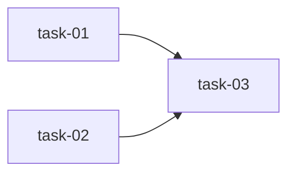
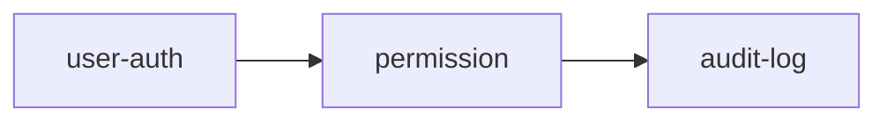

# SillySpec 文件生命周期描述

> 基于 SillySpec v4（SQLite 迁移后）实际代码，描述 `.sillyspec/` 目录下各类文件的完整生命周期。

## 1. 目录结构总览

```
.sillyspec/
├── .runtime/                    ← 运行时目录（gitignore）
│   ├── sillyspec.db            ← SQLite 数据库（替代 global.json + progress.json）
│   ├── gate-status.json         ← execute 阶段门控状态（动态）
│   ├── user-inputs.md           ← 用户输入记录（持续追加）
│   ├── artifacts/              ← 步骤输出 artifact（超长 output 截断存储）
│   ├── history/                 ← 已完成阶段的历史快照
│   ├── logs/                    ← 日志
│   ├── templates/               ← 模板
│   ├── workflow-runs/           ← workflow check 结果归档（JSON）
│   │   └── <timestamp>-<workflow>-<project>-<status>.json
│   └── worktrees/              ← git worktree 隔离环境
│       └── <change-name>/
│           └── meta.json        ← worktree 元数据（含 baselineCommit/baselineHash）
├── changes/                     ← 变更工作区（git tracked）
│   ├── <change-name>/          ← 活跃变更目录
│   │   ├── proposal.md         ← 动机与变更范围
│   │   ├── design.md           ← 技术方案与文件变更清单
│   │   ├── requirements.md      ← 角色表 + GWT 行为规格
│   │   ├── tasks.md            ← 任务列表
│   │   ├── plan.md             ← Wave 分组 + 依赖图 + 验收标准
│   │   ├── tasks/              ← 单任务实现文档目录（plan 阶段创建）
│   │   │   └── task-NN.md
│   │   ├── module-impact.md    ← 模块影响分析矩阵
│   │   ├── verify-result.md    ← 验证报告（归档产物）
│   │   ├── prototype-*.html   ← HTML 原型（可选，brainstorm 判断）
│   │   └── MASTER.md           ← 大需求拆分主控（可选，brainstorm 判断拆分时）
│   └── archive/               ← 已归档变更
│       └── YYYY-MM-DD-<name>/  ← 归档后的变更目录
├── quicklog/                    ← quick 阶段日志（git tracked）
│   └── QUICKLOG-<user>.md     ← 持续追加的任务日志
├── projects/                    ← 项目注册表
│   └── <project-name>.yaml    ← 子项目配置
├── docs/                        ← 统一文档中心
│   └── <project-name>/
│       ├── scan/               ← 代码扫描结果（7 份文档）
│       │   ├── ARCHITECTURE.md ← 技术架构 + 数据模型
│       │   ├── CONVENTIONS.md  ← 代码约定 + 框架隐形规则
│       │   ├── STRUCTURE.md    ← 目录结构
│       │   ├── INTEGRATIONS.md ← 外部集成
│       │   ├── TESTING.md      ← 测试现状
│       │   ├── CONCERNS.md     ← 技术债务
│       │   └── PROJECT.md     ← 项目概览
│       ├── modules/            ← 模块设计文档
│       │   ├── _module-map.yaml ← 文件→模块映射
│       │   └── <module>.md    ← 各模块当前状态描述
│       └── archive/           ← 归档的扫描/知识文件
├── knowledge/                   ← 跨项目共享知识库
│   ├── INDEX.md               ← 知识索引（关键词匹配）
│   └── uncategorized.md       ← 待分类知识
├── workflows/                   ← workflow 定义（init 自动生成，可自定义）
│   ├── scan-docs.yaml          ← scan 阶段产物检查 workflow
│   └── archive-impact.yaml     ← archive 阶段影响分析 workflow
├── shared/                     ← 共享目录
├── workspace/                  ← 工作区
├── ROADMAP.md                  ← 路线图（可选）
├── PROJECT.md                   ← 项目概览（可选，status/doctor 引用）
├── REQUIREMENTS.md             ← 全局需求（可选，status 引用）
├── HANDOFF.json                ← 交接信息（可选，status 引用）
├── STACK.md                    ← 技术栈描述（可选，plan/doctor 引用）
├── local.yaml                  ← 本地配置（构建/测试命令，gitignore）
└── codebase/SCAN-RAW.md        ← 原始扫描数据（gitignore）
```

## 1.1 平台模式目录结构（SillyHub 等）

> 当通过 `--spec-root` 和 `--runtime-root` 参数调用时，SillySpec 进入平台模式。
> `--spec-root` 的语义是 **SillySpec Storage Root**（替代 `.sillyspec/` 的位置），不是 scan docs root。

**调用方式：**
```shell
sillyspec run scan   --spec-root <storage-root>   --runtime-root <runtime-root>   --workspace-id <id>   --scan-run-id <id>
```

**平台模式输出结构：**
```
<spec-root>/
└── .sillyspec/                    ← SillySpec storage root（由 --spec-root 指定）
    ├── docs/                      ← 扫描文档（scan/modules/flows/glossary）
    │   └── <project>/
    │       ├── scan/
    │       ├── modules/
    │       ├── flows/
    │       └── glossary.md
    ├── projects/                  ← 项目注册表
    ├── workflows/                 ← workflow 定义
    ├── knowledge/                 ← 知识库
    ├── local.yaml                 ← 本地配置
    └── manifest.json              ← 平台模式元数据

<runtime-root>/
└── scan-runs/
    └── <scan-run-id>/            ← 单次 scan 的运行时产物
```

**路径映射：**
| 本地模式路径 | 平台模式路径 |
|-------------|-------------|
| `.sillyspec/docs/` | `<spec-root>/.sillyspec/docs/` |
| `.sillyspec/projects/` | `<spec-root>/.sillyspec/projects/` |
| `.sillyspec/workflows/` | `<spec-root>/.sillyspec/workflows/` |
| `.sillyspec/knowledge/` | `<spec-root>/.sillyspec/knowledge/` |
| `.sillyspec/.runtime/` | `<runtime-root>/` |
| `.sillyspec/.runtime/artifacts/` | `<runtime-root>/scan-runs/<scan-run-id>/` |
| `.sillyspec/.runtime/workflow-runs/` | `<runtime-root>/scan-runs/<scan-run-id>/workflow-runs/` |

**不传参数时，行为与本地模式完全一致。**

---


## 2. 全局状态文件

### `sillyspec.db` — SQLite 数据库（全局状态与变更进度）

**创建时机：** `sillyspec init` 时由 `DB.init()` 创建

**存储位置：** `.sillyspec/.runtime/sillyspec.db`

**写入方：**
- `ProgressManager` 各方法通过 SQL 写入（替代旧版 `writeGlobal()` / `_write()` 等文件操作）
- `DB.query()` / `DB.run()` — 所有状态变更通过 SQL 语句执行

**读取方：**
- `ProgressManager` 各方法通过 SQL 查询（替代旧版 `readGlobal()` / `read()` 等文件读取）
- `DB.all()` / `DB.get()` — 所有状态查询通过 SQL 语句执行

**Schema 概览：**

| 表 | 用途 | 对应旧版 |
|------|------|------|
| `project` | 项目名、schema 版本 | `global.json` 的 `_version` + `project` |
| `changes` | 变更注册表（名称、当前阶段、状态、isolation） | `global.json` 的 `activeChanges` + `progress.json` 的顶层字段 |
| `stages` | 阶段状态（status / startedAt / completedAt） | `progress.json` 的 `stages.*` |
| `steps` | 步骤状态（name / status / output） | `progress.json` 的 `stages.*.steps[]` |
| `batch_progress` | 批量进度统计 | `progress.json` 的 `batchProgress` |
| `approvals` | 审批状态 | 新增 |

> 完整 DDL 见 `design.md` 中的 Schema 章节。

**生命周期：** 项目初始化后持续存在，随状态变更实时更新。不兼容旧版 `global.json` / `progress.json` 数据（不做迁移）。

---

### `gate-status.json` — execute 阶段门控

**创建时机：** 当任意活跃变更进入 `execute` 或 `quick` 阶段时，由 `ProgressManager._updateGateStatus()` 自动创建

**删除时机：** 当所有活跃变更都不在 `execute`/`quick` 阶段时自动删除

**写入方：** `_updateGateStatus()` — 每次 `_write()` 写入 progress 时都会触发调用

**读取方：** `worktree-guard.js` hook — 在 `claude-pre-tool-use` 钩子中检查是否允许编辑

**数据结构：**
```json
{
  "stage": "execute",
  "changes": ["2026-05-28-agent-log-streaming"],
  "updatedAt": "2026-05-28T14:30:00.000Z",
  "noWorktree": false
}
```

**字段说明：**
| 字段 | 类型 | 说明 |
|------|------|------|
| `stage` | string | 当前门控阶段，值为 `"execute"` 或 `"quick"` |
| `changes` | string[] | 处于 execute/quick 阶段的变更名列表 |
| `updatedAt` | string | ISO 时间戳 |
| `noWorktree` | boolean? | 仅当 progress 中有 `noWorktree` 标记时出现 |

**生命周期：** 短暂存在，活跃变更不在 execute/quick 阶段时自动删除。

---

## 3. 变更级文件

### 变更级状态 — SQLite 表（`changes` / `stages` / `steps`）

**创建时机：** `ProgressManager.initChange()` 时通过 SQL INSERT 写入 `changes` 表，同时为该变更创建 `stages` 记录

**写入方：**
- `ProgressManager` 各方法通过 SQL 更新（如 `setStage()` 更新 `changes.current_stage`，`completeStage()` 更新 `stages.status` / `stages.completed_at`）
- `DB.run()` — 所有变更级状态变更通过 SQL 语句执行

**读取方：**
- `ProgressManager` 各方法通过 SQL 查询（如 `getCurrentChange()` 查询 `changes` 表，`getStage()` 关联查询 `stages` + `steps`）
- `DB.all()` / `DB.get()` — 所有变更级状态查询通过 SQL 语句执行

**数据模型说明：**

旧版 `progress.json` 的嵌套结构被拆解为关系型表：

| 旧版 progress.json 字段 | SQLite 表.列 | 说明 |
|------|------|------|
| `project` | `project.name` | 项目名 |
| `currentStage` | `changes.current_stage` | 当前活跃阶段 |
| `currentChange` | `changes.name` | 当前变更名 |
| `lastActive` | `changes.last_active` | 最后活跃时间 |
| `noWorktree` | `changes.no_worktree` | 跳过 worktree 标记 |
| `isolation_status` | `changes.isolation_status` | 隔离状态：pending/verified/degraded/blocked |
| `isolation_mode` | `changes.isolation_mode` | 隔离模式：worktree/native-worktree/in-place-fallback |
| `isolation_reason` | `changes.isolation_reason` | blocked/degraded 时的原因说明 |
| `stages.<name>.status` | `stages.status` | 阶段状态 |
| `stages.<name>.startedAt` | `stages.started_at` | 阶段开始时间 |
| `stages.<name>.completedAt` | `stages.completed_at` | 阶段完成时间 |
| `stages.<name>.steps[]` | `steps` 表（关联 `stages.id`） | 步骤列表 |
| `stages.<name>.steps[].name` | `steps.name` | 步骤名 |
| `stages.<name>.steps[].status` | `steps.status` | 步骤状态 |
| `stages.<name>.steps[].output` | `steps.output` | 步骤输出 |
| `batchProgress` | `batch_progress` 表（关联 `changes.id`） | 批量进度统计 |

> 完整 DDL 见 `design.md` 中的 Schema 章节。

**生命周期：** 变更目录下不再生成 `progress.json` 文件，所有变更级状态存储在 `sillyspec.db` 中。`artifacts/`、`history/`、`user-inputs.md` 保持文件系统不变。

---

### `proposal.md` — 动机与变更范围

**创建时机：**
- brainstorm 阶段最后一步"用户确认并生成规范文件"（完整流程）
- propose 阶段"生成规范文件"步骤（跳过对话，直接生成四件套）

**大体结构：**
```markdown
# Proposal

## 动机
为什么做、解决什么核心问题

## 关键问题
为什么现有方案不够（展开 2-3 个具体痛点）

## 变更范围
本次做什么

## 不在范围内（显式清单）
- 不做 X
- 不做 Y

## 成功标准（可验证）
- 旧配置默认行为不变
- 新功能在配置后可用
```

**写入方：**
- brainstorm 阶段最后一步"用户确认并生成规范文件"
- propose 阶段"生成规范文件"步骤

**元数据要求：** 头部必须包含 `author`（git 用户名）和 `created_at`（精确到秒）。`validateMetadata()` 在每个阶段完成后检查 10 分钟内修改的 `.md/.yaml/.yml` 文件是否包含这两个字段，缺失时打印警告。

---

### `design.md` — 技术方案与文件变更清单

**创建时机：**
- brainstorm 阶段"写设计文档并自审"步骤（初版，含 AI 自审）
- brainstorm 阶段"用户确认并生成规范文件"步骤（终版，覆盖 Step 8 的初版）
- propose 阶段"生成规范文件"步骤（跳过自审，含自检门控）

> ⚠️ brainstorm 中 design.md 会被写入两次：Step 8 的自审版和最后一步的确认版。确认版会覆盖自审版，因此最终文件以用户确认后的版本为准。

**大体结构：**
```markdown
# <设计标题>

author: <git用户名>
created_at: <YYYY-MM-DD HH:mm:ss>

## 背景
为什么做、解决什么问题

## 设计目标
要达成什么

## 非目标
明确不做的事（防止 scope creep）

## 拆分判断（如适用）
为什么这样组织变更、为什么不走批量模式

## 总体方案
技术方案（分 Phase/Wave）

## 文件变更清单（必填）
| 操作 | 文件路径 | 说明 |
|---|---|---|
| 新增 | src/xxx/NewFile.java | ... |
| 修改 | src/xxx/ExistingFile.java | 新增 xx 方法 |
| 删除 | src/xxx/OldFile.java | 已被 xx 替代 |

## 接口定义（代码类任务必填）
方法签名、数据结构

## 数据模型（如涉及）
表结构/字段变更

## 兼容策略（brownfield 必填）
- 未配置新功能时行为不变
- 新旧逻辑的回退路径
- 不改变的 API / 表结构

## 风险登记
| 编号 | 风险 | 等级 | 应对策略 |
|---|---|---|---|
| R-01 | ... | P0/P1/P2 | ... |

## 自审
AI 对自身设计的校验结果
```

**特殊作用：** 包含"文件变更清单"表格，被 `change-list.js` 的 `parseFileChangeList()` 解析。
解析规则：定位 `## 文件变更清单` 标题 → 截取到下一个 `##` 标题 → 解析 markdown 表格行 → 提取第二列文件路径 → 排除空值/"—"/"-"/`.sillyspec/` 开头的路径。

**消费者：** verify 阶段逐项检查、archive 阶段模块影响分析、execute 阶段确认执行范围

---

### `requirements.md` — 行为规格

**创建时机：**
- brainstorm 阶段最后一步"用户确认并生成规范文件"
- propose 阶段"生成规范文件"步骤

**大体结构：**
```markdown
# Requirements

author: <git用户名>
created_at: <YYYY-MM-DD HH:mm:ss>

## 角色
| 角色 | 说明 |
|---|---|
| 开发者 | ... |

## 功能需求

### FR-01: 需求名称
Given 前提条件
When 触发动作
Then 期望结果

（每个边界条件独立 GWT 块）

## 非功能需求
- 兼容性：...
- 可回退：...
- 可测试：...
```

---

### `tasks.md` — 任务列表

**创建时机：**
- brainstorm 阶段最后一步"用户确认并生成规范文件"
- propose 阶段"生成规范文件"步骤

**大体结构：**
```markdown
# Tasks

author: <git用户名>
created_at: <YYYY-MM-DD HH:mm:ss>

- [ ] task-01: 添加用户创建接口
- [ ] task-02: 添加角色创建接口 [model: strongest]
- [ ] task-03: 用户创建接口联调 [model: fast]
```

> tasks.md 只列任务名和编号，细节在 plan 阶段的 `plan.md` 和 `tasks/task-NN.md` 中展开。
> 支持 `[model:xxx]` 标签指定执行模型（execute 阶段"确认执行范围"步骤读取，优先级高于 AI 自动推断）。可选值：strongest（最强模型）/ fast（快速模型）等，具体映射由用户配置决定。

---

### 规范四件套的共同生命周期

1. brainstorm 末尾或 propose 阶段创建（用户确认后一次性生成）
2. plan 阶段读取作为上下文
3. execute 阶段读取作为执行依据
4. verify 阶段读取作为验证标准
5. archive 阶段检查（`module-impact.md` 三重交叉验证：proposal/design + tasks + git diff）
6. 随变更目录一起归档到 `archive/YYYY-MM-DD-<name>/`

> **注意：** `validateFileLocations()` 在阶段完成时会检查预期文件是否存在于变更目录。propose 阶段完成后预期：`proposal.md` + `design.md` + `requirements.md` + `tasks.md`。brainstorm 阶段不在此检查列表中（四件套由 propose 或 brainstorm 末步生成，brainstorm 本身没有预期产出文件）。

---

### `plan.md` — 实现计划

**创建时机：** plan 阶段"展开任务并分组"步骤

**大体结构：**
```markdown
# 实现计划

## Spike 前置验证（如需要）
| Spike | 验证内容 | 不通过后果 |
|---|---|---|
| spike-01 | ... | task-XX 推翻重设计 |

## Wave 1（并行，无依赖）
- [ ] task-01: 添加用户创建接口
- [ ] task-02: 添加角色创建接口

## Wave 2（依赖 Wave 1）
- [ ] task-03: 用户创建接口联调

## 任务总表
| 编号 | 任务 | Wave | 优先级 | 估时 | 依赖 | 说明 |
|---|---|---|---|---|---|---|
| task-01 | 添加用户创建接口 | W1 | P0 | 4h | — | ... |
| task-02 | 添加角色创建接口 | W1 | P0 | 3h | — | ... |
| task-03 | 用户创建接口联调 | W2 | P0 | 4h | task-01,02 | ... |

## 依赖关系图


## 关键路径
task-01 → task-03（最长路径，决定最短交付周期）

## 全局验收标准
- [ ] 所有单元测试通过
- [ ] （brownfield）未配置新功能时行为不变
```

**写入方：** AI 在 plan 阶段生成

**解析方：**
- `execute.js` 的 `buildExecuteSteps()` — 解析 `- [ ] task-XX:` 格式的 checkbox 生成执行步骤
- `plan.js` 的 `buildPlanSteps()` — 在"展开任务并分组"完成后动态插入任务蓝图协调器步骤
- `run.js` 的 `completeStep()` — plan 阶段"展开任务"完成后检测 plan.md 存在，触发动态步骤插入

**生命周期：** plan 阶段创建 → execute 阶段消费 → archive 阶段检查所有 checkbox 是否已勾选

---

### `tasks/task-NN.md` — 单任务实现文档

**创建时机：** plan 阶段的动态任务蓝图步骤（在"展开任务并分组"完成后由 `run.js` 插入）

**大体结构：**
```markdown
# task-01: 添加用户创建接口

author: <git用户名>
created_at: <YYYY-MM-DD HH:mm:ss>

## 任务描述
（从 plan.md 展开的任务详情）

## 实现要点
- 关键逻辑说明
- 注意事项

## 涉及文件
- src/xxx/NewFile.java

## 验收标准
- [ ] 接口可正常调用
- [ ] 单元测试通过
```

**写入方：** AI 在 plan 阶段逐个生成

**生命周期：** plan 阶段创建 → execute 阶段对应子代理读取执行

---

### `module-impact.md` — 模块影响分析

**创建时机：** archive 阶段"extract-module-impact"步骤

**大体结构：**
```markdown
# 模块影响分析

author: <git用户名>
created_at: <YYYY-MM-DD HH:mm:ss>

## 变更：<change-name>

## 模块影响矩阵
| 模块 | 影响类型 | 相关文件 | 更新内容摘要 |
|------|----------|----------|-------------|
| core | 接口变更 | src/core/api.js | 新增用户创建接口 |

## 未匹配文件
| 文件路径 | 说明 |
|----------|------|
| config.yaml | 配置文件 |

## 更新结果
| 模块文档 | 操作 | 状态 |
|----------|------|------|
| core.md | 更新 | ✅ |
```

**数据来源：** 三重交叉验证
1. `proposal.md` / `design.md` 的变更范围声明
2. `tasks.md` / `plan.md` 的任务文件路径
3. `git diff --name-only` 真实变更（**以 git diff 为准**）

**模块匹配：** 使用 `_module-map.yaml` 的 glob 路径匹配 git diff 文件到模块

**下游消费：** `sync-module-docs` 步骤读取此文件，更新 `.sillyspec/docs/<project>/modules/<module>.md`

---

### `verify-result.md` — 验证报告

**创建时机：** verify 阶段"输出验证报告"步骤

**大体结构：**
```markdown
# 验证报告

## 结论
PASS / PASS WITH NOTES / FAIL

## 任务完成度
（逐项检查任务的结果）

## 设计一致性
（对照 design.md 的检查结果）

## 探针结果
- 未实现标记扫描：...
- 关键词覆盖：...
- 测试覆盖：...

## 测试结果
（测试套件执行结果）

## 技术债务
（TODO/FIXME/HACK 统计）

## 代码审查
（问题列表 + 总体评价）
```

**位置验证：** `run.js` 的 `validateFileLocations()` 在 verify 阶段完成后检查此文件是否存在于正确的变更目录下。

---

## 4. 扫描文档（scan 阶段产物）

**创建时机：** scan 阶段的深度扫描步骤

**存储位置：** `.sillyspec/docs/<project>/scan/`

**七份文档：**
| 文件 | 生成步骤 | 内容 |
|------|---------|------|
| ARCHITECTURE.md | 深度扫描 — 技术架构 | 技术栈 + 数据库 Schema + 架构模式 |
| CONVENTIONS.md | 深度扫描 — 代码约定 | 框架隐形规则 + 实体继承 + 代码风格 |
| STRUCTURE.md | 深度扫描 — 目录结构和集成 | 目录树 + 模块说明 |
| INTEGRATIONS.md | 深度扫描 — 目录结构和集成 | 外部集成（API/MQ/缓存/SDK） |
| TESTING.md | 深度扫描 — 测试和债务 | 测试结构 |
| CONCERNS.md | 深度扫描 — 测试和债务 | 技术债务（按严重程度分组） |
| PROJECT.md | 深度扫描 — 测试和债务 | 项目概览 |

**临时文件：** `_env-detect.md`（环境探测中间产物，扫描完成后删除）

**断点续扫：** "检查已有扫描文档和子项目列表"步骤检查已有文档，**必须停下来问用户**选择「全部重新扫描」或「只补缺失文档」，不能自行决定跳过。

**Workflow 检查（post_check）：** scan 阶段完成后（verify 步骤），`run.js` 自动加载 `workflows/scan-docs.yaml`，对每个项目的 7 份文档执行结构化产物校验。检查结果为结构化 JSON 对象，包含 `roles[].outputs[].checks[]` 和 `failures[]`。校验规则定义在 `scan-docs.yaml` 的各 role output checks 中（file_exists / min_lines / contains_sections / no_placeholder 等）。检查失败时自动生成 `retry_prompts`，精确到角色级别。

**生命周期：** scan 阶段生成 → 被后续所有阶段（brainstorm/propose/plan/execute/verify）作为上下文读取

---

## 5. 模块文档

### `_module-map.yaml` — 文件到模块的映射

**创建时机：** scan 阶段"生成模块映射"步骤（可选步骤）

**大体结构：**
```yaml
# 模块映射（自动生成，可手动修改）
# 用于 archive 阶段识别变更影响的模块
modules:
  core:
    paths:
      - src/core/**
      - src/utils/**
    description: 核心工具和公共逻辑

  stages:
    paths:
      - src/stages/**
    description: 阶段定义（brainstorm/plan/execute/verify/archive等）

  cli:
    paths:
      - bin/**
      - src/index.js
      - src/run.js
    description: CLI 入口和命令路由
```

**字段说明：**
| 字段 | 类型 | 说明 |
|------|------|------|
| `modules` | object | 模块映射表 |
| `modules.<name>.paths` | string[] | glob 模式数组，匹配文件路径到模块 |
| `modules.<name>.description` | string | 模块一句话描述 |

**消费者：**
- archive 阶段 `extract-module-impact` — 将 git diff 文件匹配到模块
- plan/execute 阶段加载上下文时匹配受影响模块的文档

---

### `<module>.md` — 模块当前状态描述

**创建时机：**
- scan 阶段"生成模块核心文档"步骤（可选，首次全量生成，需用户确认）
- archive 阶段 `sync-module-docs` 步骤（首次受影响时创建，后续更新）

**大体结构：**
```markdown
# <module-name>

> 最后更新：YYYY-MM-DD
> 最近变更：<change-name>
> 模块路径：<glob patterns>

## 职责
（一句话说清这个模块做什么）

## 当前设计
（架构、数据流、关键逻辑 — 描述当前状态，不是历史）

## 对外接口
| 接口 | 说明 | 调用方 |
|------|------|--------|

## 关键数据流
```
调用方 → 模块.方法() → 依赖模块.方法() → 返回结果
```

## 设计决策
| 决策 | 理由 | 来源 |
|------|------|------|

## 依赖关系
### 依赖本模块
### 本模块依赖

## 注意事项
（维护提醒、已知限制、修改时需同步检查的模块）

## 变更索引
| 日期 | 变更 | 摘要 |
|------|------|------|
| 2026-05-28 | agent-log-streaming | 新增日志流式传输 |
```

**更新规则：**
- 正文描述当前状态（快照模式），不追加历史
- 底部"变更索引"追加变更记录
- 根据变更的"更新内容摘要"更新相关章节（archive 阶段读 module-impact.md，quick 阶段直接基于 git diff 判断）
- 更新头部元数据：`> 最后更新：YYYY-MM-DD` 和 `> 最近变更：<change-name>`

**更新时机：**
- scan 阶段"生成模块核心文档"步骤（首次全量生成，需用户确认）
- archive 阶段 `sync-module-docs` 步骤（通过 module-impact.md 驱动增量更新）
- quick 阶段"暂存和更新记录"步骤（直接匹配 git diff 文件到模块，同步更新）

**消费方：** brainstorm/propose/plan/execute 阶段"加载上下文"时读取，作为开发参考

---

## 6. Worktree 文件

### `meta.json` — worktree 元数据

**创建时机：** `WorktreeManager.create()` 调用 `git worktree add` 后写入

**存储位置：** `.sillyspec/.runtime/worktrees/<change-name>/meta.json`

**数据结构：**
```json
{
  "changeName": "2026-05-28-agent-log-streaming",
  "branch": "sillyspec/2026-05-28-agent-log-streaming",
  "baseBranch": "main",
  "baseHash": "abc123...",
  "actualBaseHash": "def456...",
  "createdAt": "2026-05-28T14:00:00.000Z",
  "worktreePath": "/path/to/.sillyspec/.runtime/worktrees/...",
  "mode": "worktree",
  "baselineFiles": [],
  "baselineCommit": null,
  "baselineHash": null
}
```

**字段说明：**
| 字段 | 类型 | 说明 |
|------|------|------|
| `changeName` | string | 变更名（禁止包含 `..`、`/`、`\`，创建时校验） |
| `branch` | string | worktree 分支名，格式 `sillyspec/<change-name>` |
| `baseBranch` | string | 基础分支，默认当前 HEAD |
| `baseHash` | string | 基础 commit hash（worktree add 时的） |
| `actualBaseHash` | string | fetch+merge 后的实际 HEAD（可能与 baseHash 不同） |
| `createdAt` | string | ISO 时间戳 |
| `worktreePath` | string | worktree 目录绝对路径 |
| `mode` | string | 隔离模式：`worktree` / `native-worktree` / `in-place-fallback` |
| `baselineFiles` | string[] | dirty baseline overlay 的文件列表 |
| `baselineCommit` | string? | baseline checkpoint commit hash |
| `baselineHash` | string? | baseline snapshot hash |

**特殊行为：** 创建后自动 `fetch origin` + `merge origin/main --ff-only` 同步远程最新代码，`actualBaseHash` 记录 merge 后的实际 HEAD。如果本地和远程没有共同祖先则跳过 merge。

**生命周期：** execute 阶段创建 → `WorktreeManager.cleanup()` 清理（git worktree remove → branch -D → rm 目录）

---

## 7. 临时 / 运行时文件

### `user-inputs.md`

**创建时机：** init 阶段创建初始骨架

**大体结构：**
```markdown
# 用户输入记录

> 每步完成时由 AI 自动追加，记录用户所有原话。

## 2026/5/28 14:30:00 | 2026-05-28-agent-log-streaming | execute: 状态检查
- 输入：用户原始需求/反馈
- 输出：AI 的输出摘要

## 2026/5/28 15:00:00 | 2026-05-28-agent-log-streaming | execute: 加载上下文
- 输出：上下文加载完成
```

**追加时机：** `run.js` 的 `completeStep()` 每次步骤完成时，如果有 `outputText`，追加一条记录。条目格式：`## <时间> | <变更名> | <阶段>: <步骤名>` + 输入/输出。

---

### `artifacts/` 下的文件

**创建时机：** `completeStep()` 中当 output 文本超过 200 字符时，截断存入 progress，完整内容写入 artifact 文件

**命名格式：** `<changeName>-<stageName>-step<当前步骤序号>-<YYYYMMDDHHmmss>.txt`

**内容：** 步骤输出的完整文本（未截断版本）

---

### `history/` 下的文件

**创建时机：** `ProgressManager.completeStage()` 阶段完成时写入

**命名格式：** `<changeName>-<stage>-<YYYYMMDDHHmmss>.json`

**内容结构：**
```json
{
  "change": "2026-05-28-agent-log-streaming",
  "stage": "brainstorm",
  "data": { /* 阶段完整数据快照 */ },
  "completedAt": "2026/5/28 12:00:00"
}
```

---

### `local.yaml`

**创建时机：** scan 阶段"生成本地配置"步骤

**大体结构：**
```yaml
# SillySpec 本地配置（自动生成，可手动修改）
project:
  type: nodejs  # nodejs/maven/gradle/generic

commands:
  build: "npm run build"
  test: "npm test"
  lint: "npm run lint"

# 测试策略：full=全量测试, module=只测变更模块, skip=跳过测试
test_strategy: module

# 模块测试路径映射（可选）
# module_paths:
#   user-service: "user/"
#   order-service: "order/"
```

**作用：** 存储项目构建/测试/lint 命令，execute 阶段执行前读取。根据项目类型（package.json/pom.xml/build.gradle）自动识别并生成默认值。

---

### `workflow-runs/` — Workflow Check 结果归档

**创建时机：**
- `run.js` 在 scan/verify 步骤和 archive extract-module-impact 步骤执行 `runPostCheck()` 后自动归档
- CLI `sillyspec workflow check ... --save` 手动触发

**存储位置：** `.sillyspec/.runtime/workflow-runs/`

**命名格式：** `<YYYYMMDDHHmmss>-<workflow>-<project>-<status>.json`

**示例：** `20260603035731-scan-docs-dashboard-pass.json`

**内容结构（结构化结果对象）：**
```json
{
  "run_id": "20260603035731-scan-docs-dashboard",
  "created_at": "2026-06-03T03:57:31.000Z",
  "source": "run.js",
  "stage": "verify",
  "workflow": "scan-docs",
  "project": "dashboard",
  "status": "pass",
  "spec_version": 1,
  "roles": [
    { "id": "arch", "name": "技术架构", "status": "pass", "outputs": [...] }
  ],
  "workflow_checks": [...],
  "failures": [],
  "retry_prompts": []
}
```

**写入方：**
- `run.js` — scan/verify 和 archive post_check 后自动调用 `saveWorkflowRun()`
- `index.js` — CLI `--save` 时调用 `saveWorkflowRun()`

**读取方：** 人工查阅 / 后续查询命令（待实现）

**注意：**
- 保存失败只输出 warning，不影响 workflow check 的 exit code
- CLI `--json --save` 时 stdout 仍为纯净 JSON，保存提示不混入
- 文件路径在 `.gitignore` 中（`.sillyspec/.runtime/`）

---

## 8. manifest.json — 平台模式元数据

**创建时机：** 平台模式 scan 阶段全部步骤完成后，由 `runStage()` 自动生成

**存储位置：** `<spec-root>/.sillyspec/manifest.json`

**触发条件：** `sillyspec run scan --spec-root <path>` 传入时

**数据结构：**
```json
{
  "workspace_id": "ws-001",
  "scan_run_id": "scan-20260604-103000",
  "source_commit": "abc123def456...",
  "generated_at": "2026-06-04T10:30:00.000+08:00",
  "schema_version": 1
}
```

**字段说明：**
| 字段 | 类型 | 说明 |
|------|------|------|
| `workspace_id` | string? | SillyHub workspace ID（来自 `--workspace-id`） |
| `scan_run_id` | string? | 本次 scan run ID（来自 `--scan-run-id`） |
| `source_commit` | string? | 被扫描源码的 git HEAD（非 git 目录时为 null，summary 会提示） |
| `generated_at` | string | ISO 时间戳 |
| `schema_version` | integer | manifest 格式版本，当前为 1 |

**写入方：** `runStage()` 中 scan 阶段完成回调

**读取方：** SillyHub 后端读取 workspace spec 信息

**生命周期：** 每次 scan run 完成时覆盖写入（同 workspace 下只保留最新一次）

---

## 9. 文件销毁与归档

### 变更归档流程

**触发：** archive 阶段"确认归档"步骤（AI 直接执行 mkdir + mv 移动变更目录）

**操作：**
1. AI 创建 `archive/` 目录：`mkdir -p .sillyspec/changes/archive`
2. AI 移动变更目录：`mv .sillyspec/changes/<name> .sillyspec/changes/archive/<name>`
3. AI 确认移动成功：`ls .sillyspec/changes/archive/<name>/`
4. `unregisterChange()` 将 `changes.status` 更新为 `archived`（SQL UPDATE）

### Worktree 清理流程

**触发：** `WorktreeManager.cleanup(changeName)`

**安全检查（mode-based）：**

| mode | 行为 | 结果 |
|------|------|------|
| `worktree`（SillySpec 创建） | 执行删除 | `cleaned` |
| `native-worktree`（外部隔离） | **拒绝删除**（除非 `--force`） | 抛错 / `kept` |
| `in-place-fallback`（降级） | 跳过，无目录可删 | `skipped` / `none` |
| unknown / missing | 不删除 | `kept` |

**操作（mode=worktree 时）：**
1. `git worktree remove <path> --force`
2. 确保目录已删除（fallback rmSync）
3. `git branch -D <branch>`（忽略分支不存在错误）
4. 清除 meta 目录
5. 返回 `{ result: 'cleaned', mode }`

**执行摘要 Worktree 状态：**

| 场景 | 摘要显示 |
|------|----------|
| worktree 目录已被删除 | `Worktree: cleaned` |
| native-worktree 保留 | `Worktree: kept (external worktree)` |
| in-place-fallback | `Worktree: none (in-place)` |
| worktree 仍存在 | `Worktree: exists` |

### 数据存储迁移

**变更背景：** v4 版本将状态存储从 JSON 文件迁移到 SQLite 数据库。

| 方面 | 旧版（v3 JSON） | 新版（v4 SQLite） |
|------|------|------|
| 全局状态文件 | `global.json` | `sillyspec.db`（`project` 表） |
| 变更级状态文件 | `changes/<name>/progress.json` | `sillyspec.db`（`changes`/`stages`/`steps` 表） |
| 备份机制 | `.bak` 文件 + 原子写入 | SQLite 事务 + WAL 模式 |
| 进度备份 | `progress.json.bak` | 不再需要（SQLite 内置 ACID） |
| 运行时缓存 | `_migrateIfNeeded()` 迁移检测 | 不再需要 |
| 兼容性 | — | **不兼容旧版数据，不提供迁移路径** |

**保持不变的文件系统存储：**
- `artifacts/` — 步骤输出 artifact（超长 output 截断存储），保持文件系统不变
- `history/` — 已完成阶段的历史快照，保持文件系统不变
- `user-inputs.md` — 用户输入记录（持续追加），保持文件系统不变
- `gate-status.json` — 仍由 `_updateGateStatus()` 生成，保持文件系统不变

### 旧版迁移

> ⚠️ SQLite 迁移后，不再支持从旧版 JSON 文件迁移。v4（SQLite 版本）与 v3（JSON 版本）数据格式不兼容。如需从旧版升级，需重新执行 `sillyspec init`。

**历史说明（仅参考，不再生效）：**
1. 旧版 `progress.json` → 复制到 `changes/<name>/progress.json`
2. 创建 `global.json`
3. 备份旧文件为 `.bak`
4. 删除旧文件

---

## 10. 可选 / 条件生成文件

以下文件不一定存在，在特定条件下才会生成。

### `MASTER.md` — 大需求拆分主控文档

**生成条件：** brainstorm 阶段"需求范围评估"步骤判断需要拆分（满足 2 条以上：3+ 独立模块、3+ 角色、跨页面流转、低耦合）

**存储位置：** `.sillyspec/changes/<主变更名>/MASTER.md`（在主变更目录下）

**大体结构：**
```markdown
# <大需求标题>

## 总体概述
（整体目标和范围）

## 拆分方案
| 变更包 | 名称 | 边界描述 | 依赖 |
|--------|------|----------|------|
| 2026-05-28-user-auth | 用户认证 | 登录/注册/JWT | — |
| 2026-05-29-permission | 权限管理 | RBAC 权限体系 | user-auth |
| 2026-05-30-audit-log | 审计日志 | 操作日志记录 | permission |

## 依赖关系

```

**下游影响：** brainstorm 最后一步"用户确认并生成规范文件"中，读取 MASTER.md 变更包列表，为每个后续包创建独立变更目录及骨架文件（proposal.md/design.md/requirements.md/tasks.md），后续包的 design.md 标记为「待设计」。

**归档时：** archive 步骤检查主变更是否有 MASTER.md，如有则标记所有阶段为 ✅ 后清除。

---

### `prototype-<名称>.html` — HTML 原型

**生成条件：** brainstorm 阶段"HTML 原型生成"步骤，AI 判断设计适合可视化（有 UI 组件/布局/交互流程）。纯后端/配置修改类需求跳过。

**存储位置：** `.sillyspec/changes/<change-name>/prototype-<名称>.html`

**特点：** 单文件（内联 CSS + JS），浏览器直接打开，ASCII/线框风格，用于设计方向确认。

---

### ~~`progress.json.bak`~~ — 已废弃

> ⚠️ 此文件在 SQLite 迁移后不再生成。旧版用于 progress.json 的备份恢复机制已被 SQLite 事务替代。历史遗留的 `.bak` 文件可以安全删除。

---

### `_env-detect.md` — 环境探测临时文件

**生成条件：** scan 阶段"构建环境探测"步骤，探测构建环境和依赖后暂存。

**存储位置：** `.sillyspec/docs/<project>/scan/_env-detect.md`

**生命周期：** 探测步骤创建 → 后续深度扫描步骤读取参考 → "自检和提交"步骤删除（`rm -f`）

---

### `ROADMAP.md` — 项目路线图

**生成条件：** 用户自行创建，非 SillySpec 自动生成

**存储位置：** `.sillyspec/ROADMAP.md`

**作用：** archive 阶段"更新路线图和提交"步骤检查是否存在，如存在则标记对应 Phase 为已完成。

---

### `CODEBASE-OVERVIEW.md` — 代码库总览

**生成条件：** 用户自行创建或由其他工具生成，非 SillySpec 自动生成

**存储位置：** 项目根目录或 `.sillyspec/` 下

**消费者：** brainstorm/plan/execute 阶段的"加载上下文"步骤都会尝试读取。

---

### `STACK.md` — 技术栈描述

**生成条件：** 用户自行创建，非 SillySpec 自动生成

**消费者：** plan 阶段"加载上下文"步骤读取，作为上下文参考。

---

### `knowledge/INDEX.md` — 知识库索引

**生成条件：** `sillyspec init` 时自动创建骨架

**大体结构：**
```markdown
# Knowledge Index

> 子代理任务开始前查询此文件，按关键词匹配，只读命中的知识文件。
> execute/quick 执行中发现的坑自动追加到 uncategorized.md，经用户确认后归类到对应文件。

<!-- 格式：关键词1|关键词2|关键词3 → 文件路径 -->
<!-- 示例：mybatis-plus|分页|Page → pagination.md -->
```

**消费者：**
- execute 阶段"确认执行范围"步骤查询，匹配 Task 关键词到知识文件
- quick 阶段"理解任务"步骤查询

---

### `knowledge/uncategorized.md` — 未分类知识

**生成条件：** `sillyspec init` 时自动创建骨架

**大体结构：**
```markdown
# 未分类知识

> execute/quick 执行中发现的坑暂存于此，用户审阅后归类到对应文件并更新 INDEX.md。
```

**写入方：**
- execute 阶段 AI 发现技术坑时追加
- quick 阶段"暂存和更新记录"步骤，如果发现项目特有的坑也追加

**下游流程：** 用户审阅后归类到 `knowledge/<topic>.md` 并更新 `INDEX.md` 索引。

---

### 后续变更包目录（骨架）

**生成条件：** brainstorm 阶段生成了 MASTER.md 且规划了多个变更包

**创建时机：** brainstorm 阶段最后一步，一次性为所有后续包创建目录和骨架

**目录结构：**
```.sillyspec/changes/<后续包名>/
├── proposal.md      ← 从 MASTER.md 提取动机和边界
├── design.md        ← 标记「待设计 - 本包 design 在该包进入 brainstorm 时完善」
├── requirements.md  ← 标记「待完善」
└── tasks.md          ← 空任务列表，标记「待 plan 阶段展开」
```

**与主变更的区别：** 主变更的四件套是完整的；后续包的 design.md 和 requirements.md 是占位符，需要在该包独立进入 brainstorm 时完善。

---

### `AGENTS.md` / `GEMINI.md` / `INSTRUCTIONS.md` — AI 工具指令注入

**生成条件：** `sillyspec init --tool codex` / `--tool gemini` / `--tool opencode`，或交互模式选中这些工具时

**注入规则：**
- 文件不存在 → 直接创建
- 已存在且无 SillySpec 标记 → 追加到末尾
- 已存在且已有 SillySpec 内容 → 跳过

**注入内容：** 代码规范（读 CONVENTIONS.md/ARCHITECTURE.md）+ 工作流程（读 sillyspec.db 确认阶段）+ 产出路径说明

---

### `QUICKLOG-<user>.md` — quick 阶段任务日志

**生成条件：** quick 阶段"理解任务"步骤（无 `--change` 时创建）

**存储位置：** `.sillyspec/quicklog/QUICKLOG-<git用户名>.md`

**大体结构：**
```markdown
## ql-20260603-001-a3f2 | 2026-06-03 14:30:00 — 修复用户登录超时问题
状态：进行中
文件：src/auth/login.js, src/config/timeout.yaml

## ql-20260603-002-7b1c | 2026-06-03 15:00:00 — 修复用户登录超时问题
状态：已完成
文件：src/auth/login.js
结果：调整超时配置为 30s，新增重试逻辑
```

**ID 规则：** 每条记录以 `ql-YYYYMMDD-NNN-XXXX` 开头作为唯一 ID。`XXXX` 为 4 位随机十六进制，防止多文件或并发冲突。追加前扫描文件中已有 `ql-<当天日期>-` 前缀的最大序号 +1，每天从 001 重新开始。此 ID 可被 design.md / plan.md / archive / 模块变更索引引用。

**生命周期：** quick 步骤 1 创建（"进行中"）→ 步骤 5 按 ql-ID 找到条目更新为"已完成"并补充实际改动。超过 500 行轮转重命名为 `QUICKLOG-<USER>-YYYY-MM-DD.md`（日期取最后一条记录），新文件需扫描同目录所有 QUICKLOG 文件中当天最大序号 +1 以继承 ql-ID。

---

### `propose` 阶段 — 快速生成规范

> **说明：** propose 是独立的阶段，与 brainstorm 并列。brainstorm 通过多轮对话探索需求后生成四件套；propose 跳过对话，基于已有设计直接生成四件套。两者产出相同（proposal.md + design.md + requirements.md + tasks.md），但路径不同。

**阶段步骤：**
1. 状态检查 → 2. 加载上下文（含模块文档加载 + 冲突检测）→ 3. 锚定确认 → 4. 探索现有代码 → 5. 生成规范文件 → 6. 自检门控 → 7. 展示并更新进度

**与 brainstorm 的区别：**
- brainstorm：对话式探索（10+ 步骤），适合新需求
- propose：快速生成（7 步），适合已有明确设计的场景
- propose 的自检门控独立于 brainstorm 的自审，检查项更聚焦

---

### `PROJECT.md` / `REQUIREMENTS.md` / `HANDOFF.json` — 项目级信息文件

**生成条件：** 用户自行创建，非 SillySpec 自动生成

**存储位置：** `.sillyspec/PROJECT.md`、`.sillyspec/REQUIREMENTS.md`、`.sillyspec/HANDOFF.json`

**消费者：** status 阶段读取展示项目基础信息和变更状态

---

### 可选文件汇总表

| 文件 | 生成条件 | 生成者 | 消费者 |
|------|---------|--------|--------|
| `MASTER.md` | 大需求需要拆分（brainstorm 判断） | brainstorm | 后续变更包骨架生成、archive 归档 |
| `prototype-*.html` | 需要可视化确认设计（brainstorm 判断） | brainstorm | 用户确认 |
| `QUICKLOG-<user>.md` | quick 阶段（无 --change 时） | quick | 任务记录 + 轮转归档 |
| ~~`progress.json.bak`~~ | ~~已废弃~~ | ~~ProgressManager._backup()~~ | ~~损坏恢复~~ |
| `_env-detect.md` | scan 环境探测步骤 | scan | 深度扫描步骤参考后删除 |
| `ROADMAP.md` | 用户自行创建 | 用户 | archive 标记 Phase 完成 |
| `PROJECT.md` | 用户自行创建 | 用户 | status 展示项目信息 |
| `REQUIREMENTS.md` | 用户自行创建 | 用户 | status 展示需求 |
| `HANDOFF.json` | 用户自行创建 | 用户 | status 展示交接 |
| `CODEBASE-OVERVIEW.md` | 用户/工具创建 | 用户 | brainstorm/plan/execute 加载 |
| `STACK.md` | 用户自行创建 | 用户 | plan/doctor 加载 |
| `knowledge/INDEX.md` | init 自动创建 | init | execute/quick 关键词匹配 |
| `knowledge/uncategorized.md` | init 创建 + execute/quick 追加 | init/execute/quick | 用户审阅后归类 |
| 后续包骨架目录 | MASTER.md 存在时 | brainstorm 末步 | 后续包独立 brainstorm |
| `AGENTS.md` 等 | 选了 codex/gemini/opencode 工具 | init | AI 工具读取 |
| `projects/*.yaml` | init 自动创建 | init | 子项目上下文加载 |
| `modules/_module-map.yaml` | scan 可选步骤 | scan | archive/plan/execute |
| `modules/<module>.md` | scan 可选步骤（全量生成）+ archive sync-module-docs | scan/archive | propose/plan/execute/verify/quick |
| `verify-result.md` | verify 阶段输出 | verify | 验证报告存档 |
| `workflows/*.yaml` | init 自动生成（scan-docs.yaml, archive-impact.yaml） | init | run.js post_check + CLI workflow check |


```
sillyspec init
    │
    ├─→ .sillyspec/.runtime/sillyspec.db
    ├─→ .sillyspec/.runtime/user-inputs.md
    ├─→ .sillyspec/projects/<name>.yaml
    ├─→ .sillyspec/docs/<name>/scan/  (骨架)
    ├─→ .sillyspec/workflows/  (scan-docs.yaml, archive-impact.yaml 模板)
    ├─→ .sillyspec/knowledge/
    └─→ .gitignore (追加 .sillyspec/.runtime/)

scan 阶段（12 步，完成后重置）
    │
    ├─→ docs/<name>/scan/ARCHITECTURE.md
    ├─→ docs/<name>/scan/CONVENTIONS.md
    ├─→ docs/<name>/scan/STRUCTURE.md
    ├─→ docs/<name>/scan/INTEGRATIONS.md
    ├─→ docs/<name>/scan/TESTING.md
    ├─→ docs/<name>/scan/CONCERNS.md
    ├─→ docs/<name>/scan/PROJECT.md
    ├─→ docs/<name>/modules/_module-map.yaml (可选)
    ├─→ docs/<name>/modules/<module>.md (可选，需用户确认)
    └─→ .sillyspec/local.yaml

    [scan 完成后 run.js 自动执行 workflow check]
    └─→ .sillyspec/.runtime/workflow-runs/<ts>-scan-docs-<project>-<status>.json

brainstorm 阶段
    │
    ├─→ sillyspec.db: changes/stages 记录自动创建
    ├─→ changes/<name>/design.md (自审步骤初版 + 确认步骤终版)
    ├─→ changes/<name>/proposal.md (确认步骤)
    ├─→ changes/<name>/requirements.md (确认步骤)
    ├─→ changes/<name>/tasks.md (确认步骤)
    ├─→ changes/<name>/MASTER.md (可选，需拆分时)
    ├─→ changes/<后续包名>/ (可选，骨架目录)
    └─→ changes/<name>/prototype-*.html (可选)

propose 阶段（替代 brainstorm 的快速路径）
    │
    ├─→ sillyspec.db: changes/stages 记录自动创建
    ├─→ changes/<name>/proposal.md
    ├─→ changes/<name>/design.md
    ├─→ changes/<name>/requirements.md
    └─→ changes/<name>/tasks.md

plan 阶段
    │
    ├─→ changes/<name>/plan.md
    └─→ changes/<name>/tasks/task-NN.md

execute 阶段
    │
    ├─→ .sillyspec/.runtime/worktrees/<name>/meta.json
    ├─→ .sillyspec/.runtime/gate-status.json
    └─→ (代码变更在 worktree 中，不在 .sillyspec/ 下)

verify 阶段
    │
    └─→ changes/<name>/verify-result.md

quick 阶段（辅助阶段，不走完整流程，完成后重置）
    │
    ├─→ .sillyspec/quicklog/QUICKLOG-<user>.md (无 --change 时)
    ├─→ .sillyspec/.runtime/worktrees/<name>/meta.json
    ├─→ .sillyspec/.runtime/gate-status.json
    └─→ docs/<name>/modules/<module>.md (直接同步，不经过 module-impact.md)

> quick 阶段"理解任务"步骤会加载模块文档作为上下文参考。

archive 阶段
    │
    ├─→ changes/<name>/module-impact.md
    ├─→ docs/<name>/modules/<module>.md (通过 module-impact.md 同步)
    └─→ changes/<name>/ → changes/archive/YYYY-MM-DD-<name>/

    [archive extract-module-impact 后 run.js 自动执行 workflow check]
    └─→ .sillyspec/.runtime/workflow-runs/<ts>-archive-impact-<project>-<status>.json
```
